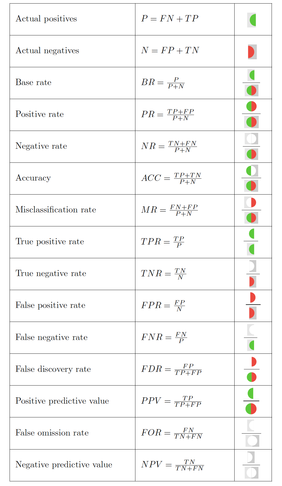

# AI Fairness

The question of what it means for an AI system to be fair can be answered in many different ways. There is no one-size-fits-all approach to AI fairness. Instead, the context and the specific characteristics of the problem at hand will be crucial to define what a fair AI system will look like across the project lifecycle.

When thinking about fairness in the design, deployment, and deployment of AI systems, it is important to always remember that these technologies, no matter how neutral they may seem, are designed and produced by human beings, who are bound by the limitations of their contexts and biases.

Human error, prejudice, and misjudgement can enter into the innovation lifecycle and create unfair biases at any point in the project delivery process from the preliminary stages of project planning, problem formulation, and data extraction to the phases of model development and system deployment.

Additionally, data-driven technologies achieve accuracy and efficacy by building inferences from datasets that record complex social and historical patterns, which themselves may contain culturally crystallised forms of bias and discrimination. 

There is no silver bullet when it comes to remediating the dangers of bias, discrimination, and unfairness in AI systems. The problem of fairness and bias mitigation in algorithmic design and use therefore has no simple or strictly technical solution.

When thinking about AI fairness, a lot of emphasis is placed on the specific inner-workings of an algorithmic system and its outputs (what we will call metric-based fairness). While this is by all means a crucial element of AI fairness which we will focus on in the course, we want to emphasise that it is still only one of five different elements of AI fairness, all of which should be in place for an AI system to be deemed fair.

While there are different ways to characterise or define fairness in the design and use of AI systems, you should consider the principle of discriminatory non-harm as a minimum required threshold of fairness. This principle directs us to do no harm to others through the biased or §discriminatory outcomes that may result from practices of AI innovation

!!! info "Key Concept: Ptinciple of Discriminatory Non-Harm"
    
    The producers and users of AI systems should prioritise the identification and mitigation of biases and discriminatory influences, which arise in the processes behind the design, development, and deployment of these systems. 
    
    Developers and users of AI systems should likewise acknowledge and address discriminatory patterns that may originate (1) in the data used to train, test, and validate the system and (2) in the model architectures (i.e., the variables, parameters, inferences, etc.) that generate system outputs.
    
    The principle of discriminatory non-harm applies to any AI system that processes social or demographic data (i.e., data pertaining to features of human subjects, population- and group-level traits and characteristics, or patterns of human activity and behaviour). However, the principle applies equally to AI systems that process bio-physical or biomedical data. In this case, imbalanced datasets, selection biases, or measurement errors could have discriminatory effects on impacted individuals and communities—for instance, where a demographic group’s lack of representation in a biomedical dataset (e.g., one used to train a diagnostic prediction model) means that the trained system performs poorly for that group relative to others that are better represented in the data.
    
    Prioritising discriminatory non-harm implies that the producers and users of AI systems ensure that the decisions and behaviours of their models do not generate discriminatory or inequitable impacts on affected individuals and communities. It can also be seen as a proportional approach to bias mitigation because it sets a baseline for fair AI systems, while, nevertheless, creating conditions for developers and users to strive towards an ideal for fair and equitable impact.
    
    Finally, the scope of the principle means that, beyond designers and users,  any individuals, organisations, or departments who are procuring AI systems must ensure that the vendors of such systems can demonstrate the mitigation of potential  biases and discriminatory influences in the processes behind their production and in their outputs.

How do we operationalise this principle? To make sure the principle is being upheld, the team designing and developing the AI system must make sure that they are following the different elements of fairness.

!!! list "Elements of AI Fairness:"

    **1. Application fairness:** The policy objectives of an AI project are acceptable to and line up with the aims, expectations, and sense of justice possessed by impacted people.

    **2. Data fairness:** The AI system is trained and tested on properly representative, relevant, accurate, and generalisable datasets.

    **3. Design fairness: The AI system has a model architecture that does not include target variables, features, processes, or analytical structures (correlations, interactions, and inferences) which are unreasonable, morally objectionable, or unjustifiable.

    **4. Metric-based fairness:** Clearly defined, transparent, and justifiable formal metrics of fairness have been operationalised into the AI system.

    **5. Implementation fairness:** The AI system is deployed by users sufficiently trained to implement them responsibly and in a bias-aware manner.

## **1. Application Fairness**

Fairness considerations should enter into your AI project at the earliest possible stage of horizon scanning and project planning. The overall fairness and equity of an AI application is significantly determined by the objectives, goals, and policy choices that lie behind initial decisions to dedicate time and resources to its design, development, and deployment. 

For example, the choice made to build a biometric identification system,
which uses live facial recognition technology to identify criminal suspects at public events, may be motivated by the objective to increase public safety and security. However, many members of the public may find this use of AI technology unreasonable, disproportionate, and potentially discriminatory. In particular, members of communities historically targeted
by disproportionate levels of surveillance in law enforcement contexts may be especially concerned about the potential for abuse and harm. Appropriate fairness and equity considerations should, in this case, occur at the horizon scanning and project planning stage (e.g.,as part of a stakeholder impact assessment process that includes engagement with potentially affected individuals and communities). Aligning the policy goals of a
project team with the reasonable expectations and potential equity concerns of those affected is a key component of the fairness of the application.
Note that in this example, we are note concerned yet with the actual otucomes of the facial recognition technology (i.e. whether it accurately recognises people from different races or ethnicities in the same proportion) but it is an even earlier question: does the impacted community think this is a fair use of this technology?
<!-- question: why do we call it fairness then? -->

Application fairness, therefore, entails that the policy objectives of an AI project are acceptable to and line up with the aims, expectations, and sense of justice possessed by those affected. As such, whether the decision to engage in the production and use of an AI technology can be described as “fairness-aware” depends upon ethical and policy considerations that are external and prior to considerations of the technical feasibility of  building an accurate and optimally performing system or the practical feasibility of accessing, collecting, or acquiring enough and the right kind of data.

Beyond this priority of assuring the equity and ethical permissibility of policy goals, application fairness requires additional considerations in framing decisions made at the horizon scanning and project scoping or planning stage.

=== ":octicons-log-16: Equity considerations surrounding real-world context of the policy issue to be solved"
    
    When assessing the fairness of using an AI solution to address a particular policy issue, it is important to consider how equity considerations extend beyond the statistical and sociotechnical contexts of designing, developing, and deploying the system. Applied concepts of AI fairness and equity should not be treated, in a technology-centred way, as originating exclusively from the design and use of any particular AI system.

    Nor should they exclusively be treated as abstractions that can be engineered into an AI application through technical or mathematical retooling (e.g., by operationalising formal fairness criteria). Limiting ones understanding of the scope of ‘fairness’ or ‘equity’ to these two dimensions will result in an artificially constrained perspective whereby only the patterns of bias and discrimination that arise in AI innovation practices or that can be measured, formalised, or statistically digested are treated as actionable indicators of inequity.
    
    Rather, equity considerations should be grounded in a human-centred approach, which includes reflection on and critical examination of the wider social and economic patterns of disadvantage, injustice, and discrimination that arise in the real-world contexts surrounding the policy issue in question. Such considerations should include an exploration of how such patterns of inequity may lead, on the one hand, to the disparate distribution of the risks and adverse impacts of the AI system or, on the other, to a lack of equitable access to its potential benefits. For instance, while the development of an AI chatbot to replace a human serviced medical helpline may provide effective healthcare guidance for some, it could have disparate adverse impacts on others, such as vulnerable elderly populations or socioeconomically deprived groups who may face barriers to accessing and using the app. Here, reflection on the real-world contexts surrounding the provision of this type of healthcare support yields a more informed and compassionate awareness of social and economic conditions that could impair the fairness of the application.

=== ":octicons-log-16: Equity considerations surrounding the group targeted by the AI innovation intervention"

    Each AI application that makes predictions about or classifies people targets a specific subset of the wider population to which they belong. For instance, a résumé filtering system that is used to select desirablecandidates in a recruitment process will draw from a pool of job applicants that constitute a subgroup within the broader population. Potential equity issues may arise here because the selection of subpopulations sampled by AI applications is non-random. Instead, the sample selection may reflect particular social patterns, structures, and path dependencies that are unfair or discriminatory. In the case of the résumé filtering system, the sample may reflect long-term hiring patterns where a disproportionate number of male job candidates from elite universities (or those with similarly privileged educational backgrounds) have been actively recruited. Such practices have historically excluded people from other gender identities and socioeconomic and educational backgrounds. As a result, the pattern of inequity surfaces, in this instance, not within the sampled subset of the population but rather in the way that discriminatory social structures have led to the selection of a certain group of individuals into that subset.

=== ":octicons-log-16: Equity considerations surrounding the way that the model’s output shapes the range of possible decision-outcomes" 
    AI applications that assist human decision-making shape and delimitthe  range of possible outcomes for the problem areas they address.
    For example, a predictive risk model used in children’s social care may
    generate an output that directly influences the space of choices available to a social worker. Because the model’s target is the identification of at risk children, it may lead to social care decisions that focus narrowly onwhether a child needs to be taken into care. This centring of negative outcomes could restrict the range of viable choices open to the socialworker insofar as it de-emphasises the potential availability of other strengths-based approaches (e.g., stewarding positive family functioning through social supports and identifying and promoting protective factors). These alternative decision-making paths could be closed off in the social care environment given how the predictive risk model’s outputs restrictively shape the range of actions that can be taken to address the problem it is being used to inform.

## **2. Data fairness:**

Responsible data acquisition, handling, and management is a necessary component of algorithmic fairness. If the results of an AI project are generated by biased, compromised, or skewed datasets, affected stakeholders will not be adequately protected from discriminatory harm. The project team should keep in mind the following key elements of data fairness.

1. Representativeness: Depending on the context, either underrepresentation or overrepresentation of disadvantaged or legally protected groups in the data sample may lead to the systematic disadvantaging of vulnerable or marginalised stakeholders in the outcomes of the trained model. To avoid such kinds of sampling bias, domain expertise will be crucial to assess the fit between the data collected or procured and the underlying population to be modelled. Technical team members should, if possible, offer means of remediation to correct for representational flaws in the sampling.

2. Sufficiency: An important question to consider in the data collection and procurement process is: Will the amount of data collected be sufficient for the intended purpose of the project? The quantity of data collected or procured has a significant impact on the accuracy and reasonableness of the outputs of a trained model. A data sample not large enough to represent with sufficient richness the significant or qualifying attributes of the members of a population to be classified may lead to unfair outcomes. Insufficient datasets may not equitably reflect the qualities that should rationally be weighed in producing a justified outcome that is consistent with the desired purpose of the AI system. 

3. Source integrity and measuremennt accuracy: Effective bias mitigation begins at the very commencement of data extraction and collection processes. Both the sources and instruments of measurement may introduce discriminatory factors into a dataset. When incorporated as inputs in the training data, biased prior human decisions and judgments—such as prejudiced scoring, ranking, interview-data or evaluation—will become the ‘ground truth’ of the model and replicate the bias in the outputs of the system. In order to secure discriminatory non-harm, you must do your best to make sure your data sample has optimal source integrity. This involves securing or confirming that the data gathering processes involved suitable, reliable, and impartial sources of measurement and sound methods of collection.

4. Timeliness and recency: If your datasets include outdated data then changes in the underlying data distribution may adversely affect the generalisability of your trained model. Provided these distributional drifts reflect changing social relationship or group dynamics, this loss of accuracy with regard to the actual characteristics of the underlying population may introduce bias into your AI system. In preventing discriminatory outcomes, you should scrutinise the timeliness and recency of all elements of the data that constitute your datasets.

5. Relevance, appropriateness, and domain: The understanding and utilisation of the most appropriate sources and types of data are crucial for building a robust and bias-mitigating AI system. Solid domain knowledge of the underlying population distribution and of the predictive or classificatory goal of the project is instrumental for choosing optimally relevant measurement inputs that contribute to the reasonable determination of the defined solution. You should make sure that domain experts collaborate closely with your technical team to assist in the determination of the optimally appropriate categories and sources of measurement.

## **3. Design fairness:**
Design fairness refers to the fact that a fairness-aware approach must be implemented *throughout* the project lifecycle, and the project team should be thinking about the potential implications their decisions at each step may have on the outcomes and fairness of the AI system. Therefore, it is not enough to simply think about fairness at the beginning of the project in order "tick the fairness box" and then forget about it. To the contrary, continuous reflection on the implications of fairenss of an AI system is needed. We will now look at different examples of how considerations on fairness might be relevant throughout different stages of the lifecycle.

### Design phase
- Problem formulation

At the initial stage of problem formulation and outcome definition, technical and non-technical members of the team should work together to translate project goals into measurable targets. This will involve the use of both domain knowledge and technical understanding to define what is being optimised in a formalisable way and to translate the project’s objective into a target
variable or measurable proxy, which operates as a statistically actionable rendering of the defined outcome.

At each of these points, choices must be made about the design of the algorithmic system that may introduce structural biases which ultimately lead to discriminatory harm. Special care must be taken here to identify affected stakeholders and to consider how vulnerable groups might be negatively impacted by the specification of outcome variables and proxies. Attention must also be paid to the question of whether these specifications are reasonable and justifiable given the general purpose of the project and the potential impacts that the outcomes of the system’s use will have on the individuals and communities involved.

These challenges of fairness aware design at the problem formulation stage show the need for making diversity and inclusive participation a priority from the start of the AI project lifecycle. This involves both the collaboration of the entire team and the attainment of stakeholder input about the acceptability of the project plan. This also entails collaborative deliberation across the project
team and beyond about the ethical impacts of the design choices made.

*Case study*

Hospital administrators in a country with a privatised medical system decided to develop an AI model to refer patients to specialised healthcare programmes. It was established that the model would determine the scale of healthcare intervention for each patient (for instance, whether the patient was granted specialised care such as intensive one-on-one services, home visits, and prioritised appointments) by scoring their health need. The model’s target variable was, therefore, decided to be 'health need,' and it was determined that the measurable proxy for this would be the patient’s history of healthcare costs.

However, when this model came into use, its discriminatory effects soon became apparent. By using previous medical costs as a proxy for health need, the trained model generated lower health need scores for patients from racial minority groups than for equally unhealthy patients in the racial majority. A couple of factors indicating health inequity were behind this.

First, because of associations between socioeconomic status and race, minority ethnic groups have traditionally faced barriers when accessing healthcare, such as an inability to take time off work or to find viable transportation to medical facilities. Second, having endured historical maltreatment in the provision of medical services, some communities have reduced trust in the healthcare system, which directly affects their level of engagement. This means that affected patients (even the insured) are less likely to run up the same level of healthcare costs as majority group patients of greater advantage.

### Development phase
- Data pre-processing

Human judgement enters into the process of algorithmic system construction at the stage of labelling, annotating, and organising the training data to be utilised in building the model. Choices made about how to classify and structure raw inputs must be taken in a fairness-aware manner with due consideration given to the sensitive social contexts that may introduce bias into such acts of classification. Similar fairness aware processes should be put in place to review automated or outsourced classifications. Likewise, efforts should be made to attach solid contextual information and ample metadata to the datasets, so that downstream analyses of data processing have access to properties of concern in bias mitigation.

*Case study*

Human Papillomavirus causes 99% of cervical cancers. Cervical screenings are critical for identifying and treating abnormalities related to this virus before they develop. An AI model has been developed to support a public health programme aiming to maximise coverage and uptake of screenings among the eligible populations.

This system facilitates patients’ access to preventative care and early intervention. The database used to build the model was organised into classifications including: age, sex, ethnicity, sexual orientation, address, health history, conditions, medicines, and lifestyle information. During the data preprocessing stage, data was formatted, and the features used for the model to identify eligible patients were selected. Because any resident registered to a GP practice who has a cervix is eligible to receive cervical screenings, the features of age, sex, address, and GP registration were selected. The model identifies individuals whose medical records
are labelled as ‘female’ and indicate an age range between 25 and 64.

However, the medical database used did not include categories such as ‘sex recorded at birth’, ‘legal sex’, or ‘gender’, which would have enabled the identification of individuals who were eligible for screening but had changed the sex classification in their medical record from female to male. By not accounting for these categories during the data pre-processing phase (i.e., by not deriving these categories from patient data) this model could not identify eligible transgender patients. This meant that an adverse effect of using the system was the creation of a dynamic of unequal access to preventative care. To receive this sort of care, eligible transgender patients would have to individually request screenings from their GP practices, presenting significant barriers to access when considering that cervical screenings are often associated with female patients. Bias within the data preprocessing stage of developing this cervical screening uptake model resulted in a replication and amplification of discriminatory healthcare processes that contribute to disparate and potentially disastrous health outcomes for transgender populations.

- Evaluating and Validating Model Structures

Design fairness also demands close assessment of the existence in the trained model of lurking or hidden proxies for discriminatory features that may act as significant factors in its output. Including such hidden proxies in the structure of the model may lead to implicit ‘redlining’ (the unfair treatment of a sensitive group on the basis of an unprotected attribute or interaction of attributes that ‘stands in’ for a protected or sensitive one). 

Designers must additionally scrutinise the moral justifiability of the significant correlations and inferences that are determined by the model’s learning mechanisms themselves. In cases of the processing of social or demographic data related to human features, where the complexity and high dimensionality of machine learning models preclude the confirmation of the discriminatory non-harm of these inferences (for reason of their opaqueness to human assessors), these models should be avoided. In cases where this is not possible, a different, more transparent and explainable model or portfolio of models should be chosen. 

Model structures must also be confirmed to be procedurally fair, in a strict technical sense. This means that any rule or procedure employed in the processing of data by an algorithmic system should be consistently and uniformly applied to every decision subject whose information is being processed by that system. Your team should be able to certify that any  relevant rule or procedure is applied universally and uniformly to all relevant individuals.

Implementers of the system, in this respect, should be able to show that any model output is replicable when the same rules and procedures are applied to the same inputs. Such a uniformity of the application of rules and procedures secures the equal procedural treatment of decision subjects and precludes any rule-changes in the algorithmic processing targeted at a specific person that may disadvantage that individual vis-à-vis any other. It is important to note that the consistent and uniform application of rules over time apply to deterministic algorithms, whose parameters are static and fixed after model development. Close attention should be paid, in this sense, to the procedural fairness issues that may arise with the use of dynamic learning algorithms. This is because the parameters and inferences of such systems evolve over time and can yield different outputs for the same inputs at different points in system’s lifespan.

*Case study*

Long wait times for emergency treatment in hospitals poses risks to patients requiring urgent care. At the same time, discharging existing patients to make their beds available also poses risks if patients are released too soon. This leaves doctors with a highstakes dilemma where they must balance the needs of both new and existing patients while optimising the hospital’s available resources.

An AI application was developed to support doctors in deciding when patients are safe to be discharged. The model predicts patients’ risk of hospital emergency re-admissions within 30 days of discharge by considering patient features such as vital signs (blood pressure, heart rate, temperature, oxygen levels), and data from their Electronic Health Records (EHRs) (including current illness, test results, medication history, other diagnoses, and previous hospital admissions). The model presents doctors with a patient score from 0 to 20, with 20 representing the highest level of risk and 0 indicating that the patient is likely to be safe and well after discharge. Doctors can use this information to identify which patients are safe to be sent home.

However, this predictive risk model raises fairness and equity concerns regarding the treatment of socioeconomically deprived subpopulations. Due to inequalities in primary healthcare provision (e.g., lack of cultural competency, stigmatisation, receiving less appropriate care such as lower rates of medication and diagnostic testing) and barriers to access (e.g., inability to take time off from work or find childcare), socioeconomically disadvantaged patients are less likely to have comprehensive or lengthy medical records. By using various features in electronic records that are indicative of the provision of and access to primary healthcare as a significant factor in the prediction of patient risk without correcting for health inequalities, the AI application had incorporated a discriminatory analytical structure. The absence of a substantial medical history and a record of healthcare maintenance and intervention among members of socioeconomically disadvantaged groups operated as a lurking discriminatory proxy for their deprived status, and the presence of the same for materially advantaged patients meant that they would be scored as having a greater health risk even if they were potentially healthier and more medically resilient. This led to the former having a greater chance of being released too soon and being vulnerable to health complications, and the latter being prioritized for continued treatment.

## **4. Metric-based fairness:**
As part of the safeguarding of discriminatory non-harm and diligent fairness and equity considerations, well-informed consideration must be put into formal metrics of fairness that can be operationalised into the AI system being developed will be defined and measured.

Metric-based fairness involves the mathematical mechanisms that can be incorporated into an AI model to allocate the distribution of outcomes and error rates for relevant subpopulations (e.g., groups with protected or sensitive characteristics). In formulating an approach to metric-based fairness, the project team will be confronting challenging issues like the justifiability of differential treatment based on sensitive or protected attributes, where differential treatment can indicate differences in the distribution of model outputs or the distribution of error rates and performance indicators like precision or sensitivity.

There is a great diversity of beliefs in this area as to what makes the consequences of an algorithmically supported decision allocatively equitable, fair, and just. Different approaches to metric-based fairness—detailed below—stress different principles: some focus on demographic parity, some on individual fairness, others on error rates equitably distributed across subpopulations. The determination of metric-based fairness should heavily depend both on the specific use case being considered and the technical feasibility of incorporating your chosen criteria into the construction of the AI system. (Note that different fairness-aware methods involve different types of technical interventions at the pre-processing, modelling, or post-processing stages of production). Again, this means that determining a fairness definition should be a cooperative and multidisciplinary effort across the project team.

Take note, though, that these technical approaches have limited scope in terms of the bigger picture issues of application and design fairness that we have already stressed. Moreover, metric-based approaches face other practical and technical barriers. For instance, to carry out group comparisons, formal approaches to fairness require access to data about sensitive/protected attributes as well as accurate demographic information about the underlying population distribution (both of which may often be unavailable or unreliable, and furthermore, the work of identifying sensitive/protected attributes may pose additional risks of bias). Metric-based approaches also face challenges in the way they handle combinations of protected or sensitive characteristics that may amplify discriminatory treatment. These have been referred to as intersectional attributes (e.g. the combination gender and race characteristics), and they must also be integrated into fairness and equity considerations. Lastly, there are unavoidable trade-offs and inconsistencies between mathematical definitions of metric-based fairness that must be weighed in determining which of them are best fit for your use case.

We will now go deeper into what metric-based fairness is trying to measure, and how different definitions compare to each other.
Metric-based fairness refers to the outcome(s) of a (machine learning) algorithm engaging in the task of **classification**. 

::: info
'The goal of classification is to leverage patterns in natural and social processes to conjecture about uncertain outcomes' (Barocas et al. CITE)
:::

An outcome may be uncertain because it lies in the future (in which case the AI is said to be predicting an outcome), or it may be uncertain because even though it has already occured, we are unsure about it. What makes classification possible is the existence of patterns between the outcome of interest and the data we can observe. Machine learning makes use of these patterns to decide how it classifies certain phenomena in populations (Barocas et al. CITE).

Let us call our outcome of interest Y and assume it is a binary variable, and let's assume we have a number of characteristics or attributes X = (X1, X2, ..., xN) which we can observe. For every instance of the data i, a classifier f() takes the known attributes Xi and uses them to decide whether it classifies instance i as a 1 or 0. That is 

Y*= f(Xi)

where Y* is 1 or 0. 

All of the metric-based fairness definitions have to do with how the outcomes of the classifier Y* compare to the actual value of the target variable Y.

|       | Y* = 1  | Y* = 0
| ----------- | ----------- | ---
| Y=1    | True positive    | False negative
| Y=0   | False positive       | True negative

Clearly, for any classifier we would want to maximise the number of correct classifications (either true positives or true negatives), or alternatively minimise the errors (either false positive or false negatives). The problem, as we will see, is that it is not possible to minimise both errors at the same time: there are trade-offs between both kinds of errors.

<figure markdown>
  { align="center" }
  <figcaption>Visual representation: White dots represent positive samples, black ones negative samples. The big circle constitutes the classifier.</figcaption>
</figure>

From this we can derive various statistics that will then help us construct various definitions of fairness.

<figure markdown>
  { align="center" }
</figure>

Case study: We are looking to build a case study on health equity but for the time being we will use the example of a loan granting system. 

On a loan granting system, the target variable Y is whether individual i will repay their loan over the next N years (Y=1 if they will and Y=0 if the won't).

If Xi are all the characteristics of individual i, then the classifier takes Xi and predicts whether the individual will repay the loan in N years (Y*= f(Xi)).

In this case Y*=1  if the algorithm predicts the individual will repay the loan, and so Y* =1  implies the individual will get the loan and Y* =0 predicts they won't, and so they do not get the loan.

|       | Y* = 1  | Y* = 0
| ----------- | ----------- | ---
| Y=1    | Individual is predicted to repay their loan and they actually do    | Individual is predicted not to repay loan and is thus not given a loan, *but would have repayed* if they had been given the loan
| Y=0   | Individual is predicted to repay loan but they do not       | Individual is predicted not to repay loan and thus is not given loan, but had he been gvien a loan, they would  not have repayed it

### How does this relate to fairness?

There are two big groups of AI metric-based fairness definitions: 
1. Individual fairness

2. Group fairness

**Group fairness:** Let us now assume we have a sensitive attribute or protected characteristic A (and for simplicity let us assume it is also binary). All of our group fairness metrics will have to do with how the outcomes of these two groups compare. Basically, we want people from the protected characteristic to be treated the same with respect to one of these fairness metrics as all other individuals.

Group fairness definitions are usually grouped into three different categories, depending on what kind of independence one imposes between different variables.

Independence:  Actual outcome Y is independent of protected charcteristic A.

Separation: Outcome of classifier Y* is independent of A conditional on actual outcome Y. 

Sufficiency: Actual outcome Y is independent of A conditional on the outcome of the classifier Y*.

Going back to the loan granting example: Let's assume that the binary protected characteristic is whether someone is white or not. For simplicity of the example we will assume in this case that we can group all non-white people into one group. In reality, this is obviously not the case, and the problem of fairness is more complicated as we add not only more protected characteristics, but also possibilities for each protected characteristic (This needs expandind). However, for this illustrative purpose, we will simplify it and assume A=0 if white, and A= 1 if not.

Independence: In this case it would mean that the actual outcome of whether someone will repay their loan in two years is independent of whether they are white or not.

Separation: In this case it would mean that the outcome of the classifier (that is whether someone is given the loan or not) is independent of whether they are white or not, conditional on the actual outcome (that is, conditional on whether they would have repayed their loan in two years).

Sufficiency: In this case it would mean that the actual outcome of whether someone will repay their loan in 2 years or not is independent of whether they are white or not conditional on the outcome of the classifier (that is, conditional on whether the model predicts they will be able to repay their loan in 2 years or not).

- What do you think about the potential merits of fairness definitions this case? 
- What are their strenghts and weakenesses *given this particular example*?
- How might these change if we think about another example? (Here, it might be useful to use COMPAS/Northpointe example as the classifier is predicting whether someone gets assigned a bad outcome, a high-likelihood of recidivism, whereas in this case the algorithm is predicting whether someone is assigned a positive outcome, whether they are given a loan or not. This has implications for the trade-offs between false positive and false negative which I think is crucial to understanding the overall tradeoffs. 

Add specific definitions and trade-offs between them.

## **5. Implementation fairness:**

