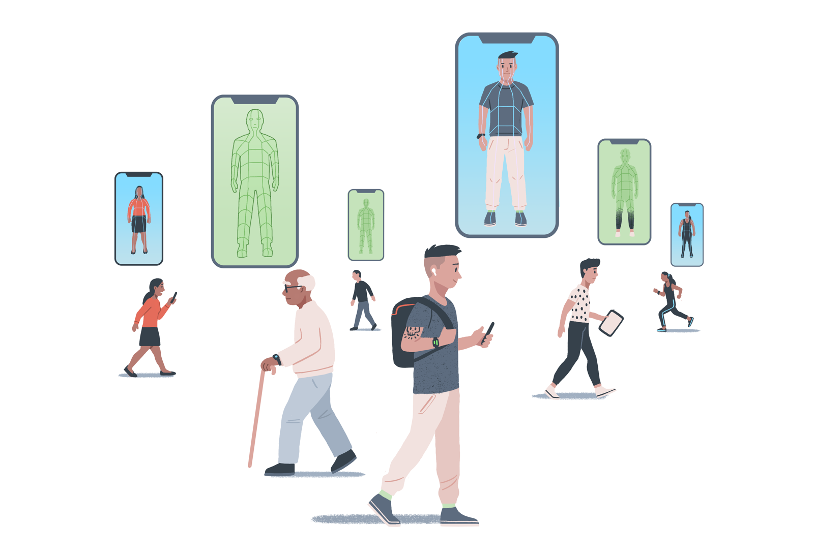

# Reuse of Illustrations

All of the illustrations in this folder were commissioned for the purpose of the Turing Commons project and were illustrated by [Johnny Lighthands](https://www.johnnylighthands.co.uk).

As with the rest of the content in this repository, you are free to copy and redistribute the material in any medium or format, as well as remix, transform, and build upon the material for any purpose, even commercially.
However, when doing so, you must give appropriate credit both to the illustrator and this project, provide a [link to the license](https://github.com/chrisdburr/turing-commons), and indicate if changes were made.
You may do so in any reasonable manner, but not in any way that suggests the licensor endorses you or your use.

[Creative Commons Attribution 4.0 International License][cc-by].

[![CC BY 4.0][cc-by-image]][cc-by]

[cc-by]: http://creativecommons.org/licenses/by/4.0/
[cc-by-image]: https://i.creativecommons.org/l/by/4.0/88x31.png