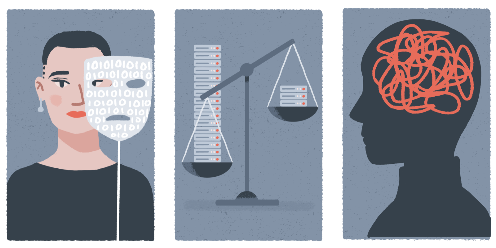

# Course Announcement: AI Ethics and Governance

**What do we mean when we talk about the ethics of artificial intelligence?** If guided by popular culture and science fiction, we would probably turn to images of seemingly sentient robots and questions on the ethics of our (mis)treatment of them.[^examples]

[^examples]: Some recent(ish) examples are the novels [Machines like Me](http://www.ianmcewan.com/books/machines.html) by Ian McEwan, [Klara and the Sun](https://www.klaraandthesun.com) by Kazuo Ishiguro, and the HBO TV show [Westworld](https://www.hbo.com/westworld).

However fascinating they may be, we are not yet at a stage where we need to grapple with these considerations. But this does not mean that we should not care about AI ethics. Quite the contrary. As our society becomes increasingly reliant on algorithms and other data-driven technologies, their functionings and outcomes have immense consequences on individuals, communities, and society at large.

There is no shortage of concerns, and these keep expanding as our uses of technology multiply. What do privacy and autonomy mean in a datafied society? How do we define and implement fair, non-biased outcomes when using AI systems? And what should the requirments of explainability and transparency be as AI and machine learning become increasingly complex and opaque? These are just some of the ethical questions that the ubiquity of AI gives rise to.

We will explore these and other topics in the AI Ethics and Governance course delivered by the Turing Commons team. The course will take place between the 21st and the 25th of November and is now open for registration. It is organised and run by Dr. David Leslie, Dr Christopher Burr, and Claudia Fischer as part of the Turing Commons series of online courses.

The five day course is scheduled between 10am and 4pm (GMT), and each day will comprise a series of lectures, hands-on sessions through structured activities, and group discussions.

After completing the course, participants should have an understanding of the following:
- what practical ethics is and how it serves as a foundation for AI ethics;
- how AI ethics can be understood in terms of AI harms which violate certain core values;
- what the stakeholder engagement process is and what it entails;
- what a stakeholder impact assessment is and how to carry one out;
- the different elements of AI fairness;
- the problem of bias in AI and how to address it;
- the key elements of transparent and explainable AI;
- what the CARE & ACT principles are and how to apply them in their own research.

The course will be delivered online using Zoom, and to ensure effective group discussion will be limited to 30 participants.
Following the live workshops, recordings of the taught components will be made available to all (along with relevant materials) for asynchronous self-study. **Apply [here](https://www.eventsforce.net/turingevents/frontend/reg/tregistration.csp?pageID=81528&ef_sel_menu=1171&eventID=232&tempPersonID=171164)**. 

We look forward to seeing you in AI Ethics and Governance soon!
