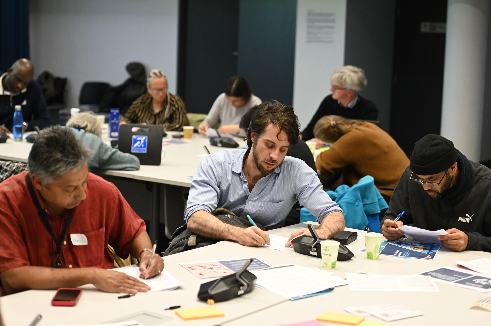
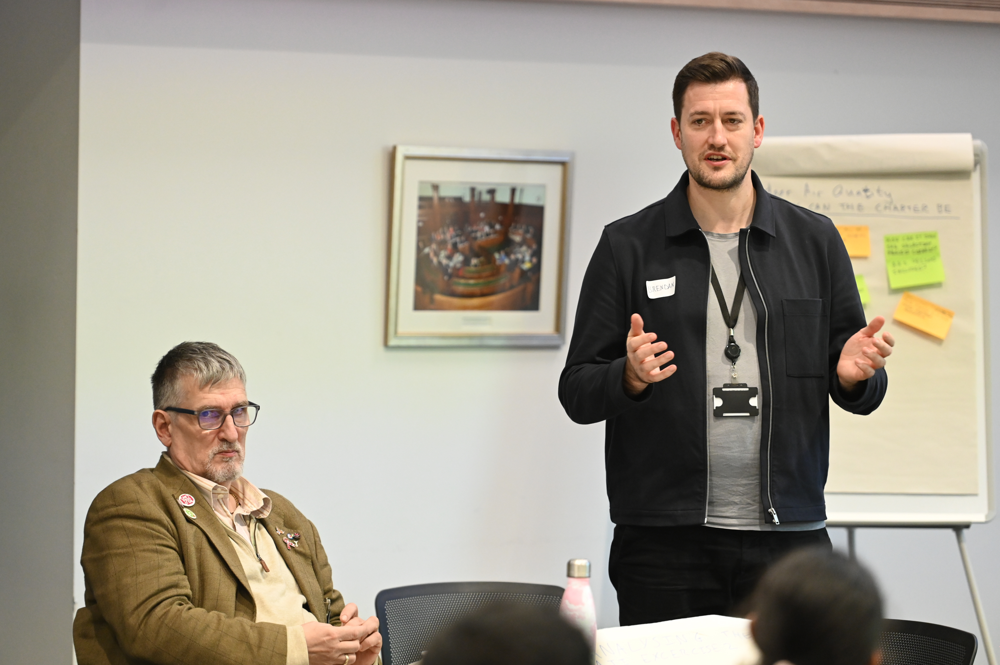
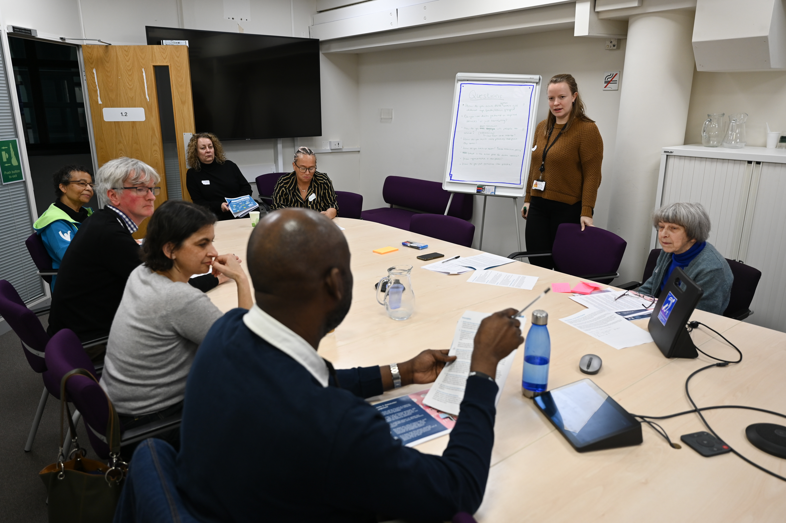

# How ordinary residents are creating Camden Council’s Data Charter
## _Reposted from [The London's Office of Technology and Innovation](https://loti.london)'s blog by Sam Nutt. Link to the original post [here](https://loti.london/blog/how-ordinary-residents-are-creating-camden-councils-data-charter)._

Over three weekends in January, Camden Council are running a Resident’s Panel with a group of local residents to reflect on, sense-check and make improvements to their Data Charter, which was created a year earlier. 
At LOTI, we’ve [identified resident engagement](https://loti.london/toolkit/recommendations-data-ethics-capabilities/) as one of the key capabilities for councils to become more responsible innovators and ethical users of data, and given my other area of work on innovative participation methods, I was excited to attend the second weekend meeting of this Panel, and blog about my impressions. 

### Background to the Resident’s Panel

This Charter was originally created in 2021 and implemented in January 2022, using a combination of participatory methods, including distributed dialogues in local community spaces and a Resident Panel. 
It is the first data policy of its kind, fully proposed and developed by residents and adopted by the Council. 
The Charter established seven principles that Camden Council was committed to working by in their data projects, as well as made recommendations for data governance practices for Camden.

One of those commitments was to reconvene a new Panel a year after the Data Charter’s implementation – which I was attending this January. 
This Second Panel was all about transparency and accountability, two of the principles of the Charter. 
It invited a representative group of residents from the borough to reflect on how well Camden had fulfilled their commitments to the Charter, and where the Charter could be improved. 
The day I attended the panel, the residents were working through four case studies of data projects to see how the Data Charter had been applied, assessing where they thought the charter worked or didn’t, and where it could be improved. 

Brendan Kelly, the Data Custodian for Camden Council, explained why Camden was doing the process:

!!! quote

  We knew that the Data Charter wasn’t going to be perfect the first time around, and we said at the time that it was going to be a living document. 
  This was always an important part of the process, being able to go back to residents, a second set of residents with fresh eyes, and also on the work in between. 
  It keeps the democratic process going.

### My reflections on the day

Above all, the day showed just how well ordinary people are able to give valuable and thoughtful direction around data governance and innovation, when trusted to do so. One common misconception about participatory processes is that they don’t work as well for more ‘technical’ knowledge barriers. However, one hour in the room or breakout groups of Camden’s Resident Panel showed just how false this is. Residents were partly aided by the Alan Turing Institute, which developed a ‘Residents Guide to Data’ – a great resource for any local authority wanting to help educate residents on how councils use data. 

Claudia Fischer, Researcher at the Alan Turing Institute and a facilitator in the Resident Panel, said:

!!! quote

  Instances like the Camden Resident’s Panel highlight the importance of communication and effective dialogue between the developers and deployers of AI systems, and those using them. 
  Residents were not only eager to learn more about how these systems work and how data is stored and used, but they also raised relevant issues about how those issues can personally impact them and other users of Camden’s services.

Residents really made great points and suggestions, that the council might otherwise have missed. 
It resonated with a recent article from Democracy Next, on ‘How non-expertise becomes a strength”. 
It describes how a lack of existing preconceptions or ideology on expert topics sets the foundation for better deliberation, where insights emerge through co-learning, respectful listening and sharing of ideas, which leverage a range of lived experiences. 

The key issue that emerged in discussions was the importance (and lack of) communication about data. 
Participants thought the Charter and the work of the Council were good – when they knew about it. 
However, they felt the Council could do more actively communicating how and why they were making decisions using the Data Charter to residents. 
It also spoke to broader questions about how the benefits of increased trust from participating in a small, deliberative body (the Panel was 20 residents) can be scaled up to the whole community.

Because the process clearly built trust amongst participants in the council. 
At the start of the process, none of the residents fully realised what Camden was doing with data, including how they responsibly and ethically managed ethical risks. 
And, trust in data may well translate into broader trust in the council in other areas, so this is an immensely worthwhile process. 
This quote from Simon, a Camden resident, put it best:

!!! quote

  The most important thing is the fact that we’re in the room, and that the council is setting stuff up so that we’re asked about it. 
  People fear the unknown, like AI, or profiling. But, if you share [how you are working on] it with them, share why, then you are going to get so many better outcomes. 
  If you engage, you will get better outcomes for everyone else.

Some of the other insights on Camden’s practices that the residents reflected on included:

- A possible flaw that residents identified in the data collection process of one of the case studies, and thus the data quality, of a research project. 
- The manner in which digital exclusion might produce inequalities when data processes only benefit those who can use the internet.
- The broad importance of accessibility, when it comes to understanding information about data, as well as accessing council services and communication. 
- More explainable, jargon-free language – and in general, clearer communication – for different user groups.
- Sharing the evaluation of the efficacy of automated processes versus human processes.

Another takeaway that I found interesting was how ordinary people do not see or experience the council in terms of discrete services or policies. 
People are naturally systems thinkers. 
For example, when discussing one case study on monitoring air quality actually inside private properties, residents asked whether the council was factoring in new policies like the introduction of Low Emission Zones. 
People also brought in phenomena like digital exclusion, the cost of living crisis, the historical closure of public services, and other things, constantly. 
When it comes to communicating with residents and articulating a vision of life in the borough, it highlighted how councils need to tell better, inter-connected stories about their work. 
I would point interested readers to the Centre for Public Impact’s work on [Storytelling for Systems Change](https://www.centreforpublicimpact.org/partnering-for-learning/storytelling-for-systems-change) as a good starter for this.

Overall, my day observing the Charter demonstrated exactly why councils need to be engaging with residents, and what a good version of that looks like. 
Residents can provide real insight and input, elevating policy to a level that a council wouldn’t otherwise be able to match – even on the most technical of topics. 
And residents wanted to do this, they were invested in the process, believed that what they said would directly impact the council’s work, and ultimately improve the lives of the communities they are part of. 
My next step is to take these learnings and see how we can foster similar practices across London, to truly foster a more participatory data ecosystem in whatever borough you live in.

