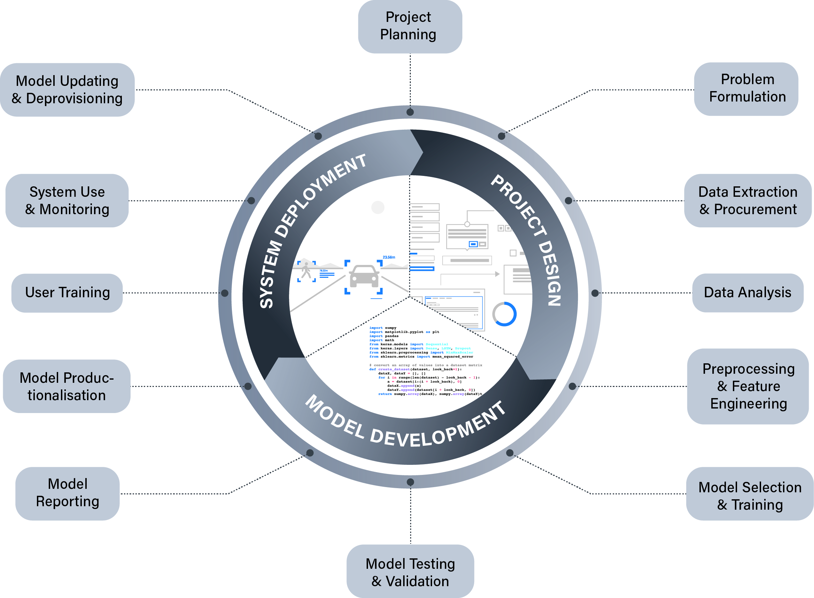

# When should you engage?

A complete answer to the question of *when* you should engage will, ultimately, depend on the specific details of your project.
For instance, if your project involves the collection of experimental data from research subjects, then a significant part of the engagement will likely happen early on in your projects lifecycle.
In contrast, if your project only requires communication of results and findings (e.g., for the goal of increased public awareness), then engagement may happen towards the end.
The goal in this chapter is not to provide an exhaustive list or flowchart that can help you answer the question for any project—this would not be feasible.
Instead, what we will be exploring are two models that can help identify common stages in data science and AI projects in order to identify which stages are likely to benefit from public engagement.

## The ML/AI Project Lifecycle

A significant portion of modern AI methods are data-driven and rely on various types of machine learning to identify patterns in the data and construct predictive models that can classify, forecast, or optimise goals (among other things).[^symbolic]
As such, data science projects are increasingly turning to machine learning algorithms to help generate knowledge or support scientific processes of discovery (e.g., drug discovery).

[^symbolic]: This is in contrast to symbolic or rules-based methods where a human is required to program the underlying logic that determines the machine's behaviour.

Although a wide range of differences exist between research and innovation projects, the following model is a useful abstraction for reflecting on the typical activities associated with the lifecycle of a project that involves some form of ML or AI.

{ align="center" }

As the above figure demonstrates, we can split a typical project into three over-arching stages:

1. Project Design
2. Model Development
3. System Deployment

'Project Design' comprises those activities that set the foundation for the practical development of the model (e.g., desk-based research, experimental design, data cleaning, exploratory data analysis).

'Model Development' captures the technical processes of building a predictive model, as well as the important process of documenting how it was developed. This is not just important for the reproducibility of science, but is also vital for innovation (e.g. for regulatory compliance).

Finally, 'System Deployment' captures the implementation and use of a model within a sociotechnical system. In the context of a scientific research project, this may include the application of the model to additional datasets to generate insights or knowledge. Whereas in the context of a commercial organisation, this could refer to a wide range of use cases (e.g., recommendation system for online bookings, predictive model for diagnoses in healthcare).

This macroscopic perspective is helpful as a heuristic, but the main benefits of this model for facilitating pubic engagement comes when we look at the lower-level stages.

### Project Design Stages

| Stage | Description | Public Engagement Relevance |
| --- | --- | --- |
| **Project Planning** | | |
| **Problem Formulation** | | |
| **Data Extraction or Procurement** | | |
| **Data Analysis** | | |

### Model Development Stages

| Stage | Description | Public Engagement Relevance |
| --- | --- | --- |
| **Preprocessing and Feature Engineering** | | |
| **Model Selection and Training** | | |
| **Model Testing and Validation** | | |
| **Model Documentation** | | |

### System Deployment Stages

| Stage | Description | Public Engagement Relevance |
| --- | --- | --- |
| **Model Productionalisation** | | |
| **User Training** | | |
| **System Use and Monitoring** | | |
| **Model Updating or Deprovisioning** | | |

The above framework supports project governance by supporting reflection and planning related to public engagement.
The following illustrative example helps to demonstrate this point.

!!! abstract "Shaping Attitudes to Public Policy"

    A group of researchers working for a news organisation are carrying out a project to explore how the political attitudes of members of the public may be influenced by algorithmically generated articles.
    One of their goals is to determine whether the emotional valence of an article affects the likelihood of the reader agreeing with or disagreeing with public policies that are being discussed by the news articles.
    
    Using the AI project lifecycle model, they identify three initial stages and activities during their preliminary project planning:
    
    - Stakeholder identification and engagement to support experimental design (Project Planning)
    - Participant data gathering and informed consent (Data Extraction or Procurement)
    - Experiment and participant feedback (Model Testing and Validation)
    
    However, when they begin the initial stakeholder identification and engagement they hit a roadblock.
    During discussion and deliberation with potential users of the news platform, the research team ask the participants to share their attitudes towards algorithmically generated content.
    A majority of the participants have a critical attitude towards the use of AI to generate news contents, and express strong disapproval of the proposed idea of influencing attitudes towards public policies through what they see as "emotional manipulation".

    On the basis of this feedback, the research team decide to change their research plan by co-designing an alternate system with the participants. The revised system still uses generative AI, but as a decision support for a human journalist. The team also add a further engagement activity during the `model documentation` stage to help mitigate any further aversion towards the system by ensuring sufficient public understanding and awareness of how the system operates.

As we build upon our initial understanding of this model by exploring 