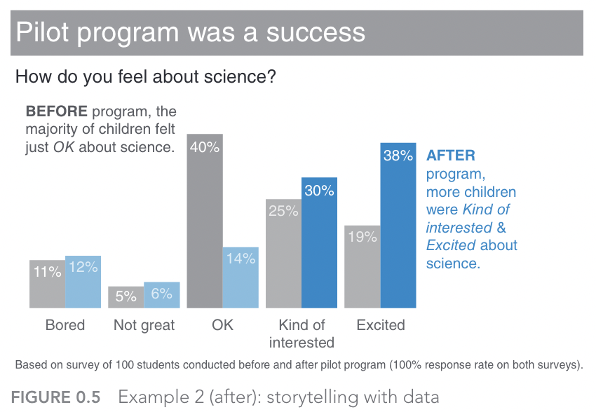
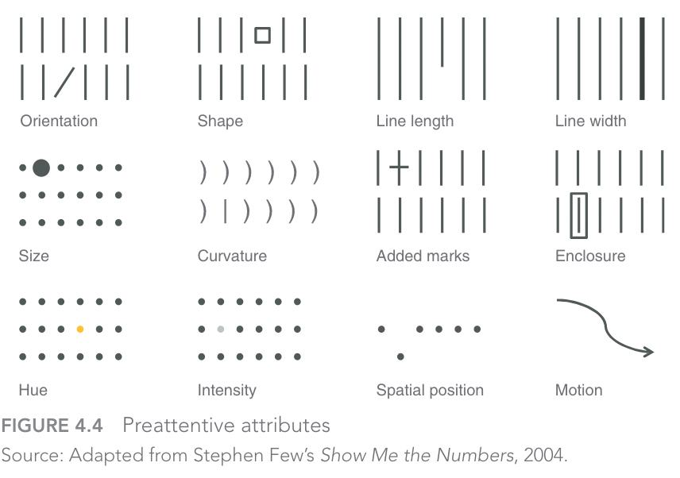
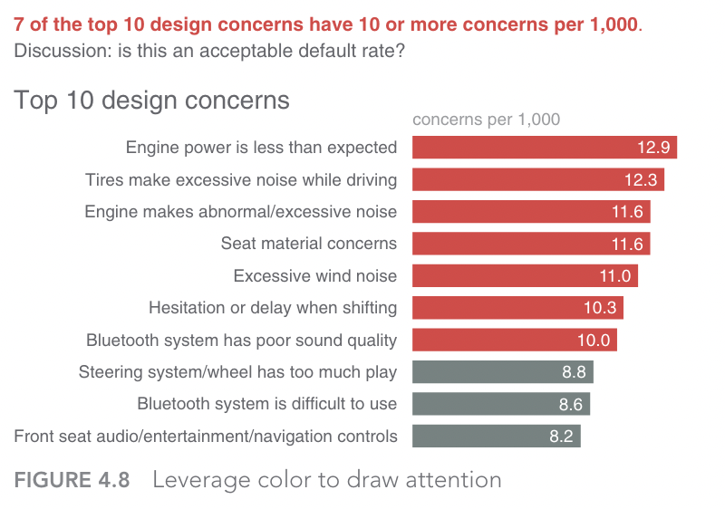
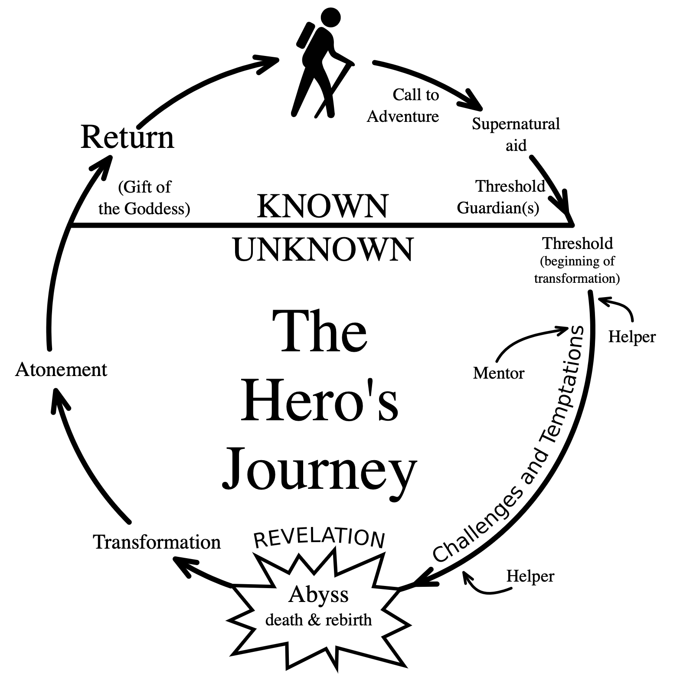

# Storytelling with Data

> "Data tells a story!"

This phrase, which gets thrown around a lot, does contain a kernel of truth.
But telling a story with data is not always straightforward, and data do not tell stories on their own.
It takes careful analysis and informed deliberation to make sure that data tell the right story, and that the story is engaging to those who want or need to hear the story.
Consider the following graph, for instance:

Now, ask yourself the following questions:

!!! question "Questions"

    1. What story do you think this graph is trying to tell?
    2. Which part of the graph caught your attention initially?

Cole Nussbaumer Knaflic's excellent book, *Storytelling with Data* is full of examples such as this one, in which badly designed or ordinary graphs are transformed into engaging and insightful visualisations that help tell a story and realise various goals.
The previous graph, for example, is altered into the following one, where a) more supportive messaging helps explain how a new program improved children's interest and engagement in science, and b) better use of colours help to direct the audience's attention to the values of significance (i.e., the increased percentages of children who were either 'interested' or 'excited' in science following the intervention).

In this section, we are going to look at three lessons (based on Knaflic's book) to help tell more engaging stories with data:

1. Choose the right tool for the job
2. Understand the limits of attention
3. Construct a clear narrative

## Choosing the right tools

You would not choose a hammer to drill in a screw. Sure, it may get the screw into the wall, but it's certainly not the most effective tool for the job.
In the context of data visualisation, there are no shortages of graphs (tools) and libraries (toolkits) to help you create a multitude of different graphs.
For example, the popular Seaborn data visualization library for Python:

<iframe src="https://seaborn.pydata.org/examples/index.html" width="100%" height="500px"></iframe>

But, similar to the hammer analogy, it's easy to end up with choice paralysis in situations like this, especially when there are so many options available. 

!!! example Tools for Data Visualisation

    Although far from being an exhaustive list, the following options are a varied set of examples for data visualisation tools:

    1. [Tableau](https://www.tableau.com/): powerful tool for data analysis, BI, and visualisation
    2. [Canva](https://www.canva.com): an online graphic design platform with a simple interface
    3. [D3.js](https://d3js.org): a javascript library well suited to web-based visuals
    4. [Google Charts](https://developers.google.com/chart): another free option for embedding (many different) charts into webpages
    5. [Datawrapper](https://www.datawrapper.de): a popular option among cvommunicators (e.g. journalists) with a good range of interactive and responsive charts
    6. [Bokeh](https://docs.bokeh.org/en/latest/docs/gallery.html): an Python library for creating interactive visualisations with a variant for [R](https://hafen.github.io/rbokeh/)

So, how do you choose the right tool?
How do you select the right visualisation?

Well, simply put, you have a clear answer to the questions from the preceding chapters:

- Who is your audience?
- What matters to them (or, what do they value?
- Why are you engaging them?
- What is your goal?

When you can satisfactorily answer these questions you will probably know which tool is the right one top use.
However, there are still a couple of hazards that could get in your way.

## ATTENTION!!!

You're about to take part in a short experiment.
Watch the following video:

<iframe width="560" height="315" src="https://www.youtube.com/embed/VkrrVozZR2c" title="YouTube video player" frameborder="0" allow="accelerometer; autoplay; clipboard-write; encrypted-media; gyroscope; picture-in-picture" allowfullscreen></iframe>

Did you spot the change?

As the video emphasises, our limited cognitive capacity forces us to pay attention to the details that we expect to be most salient to the current tasks we are engaged in.
When you are communicating with or engaging an audience, they will also be in a similar predicament—forced to "make (sub-conscious) choices" about what to pay attention to.
Therefore, it is important for you to have an understanding of how you can reduce cognitive load and make it easier for your audience to *pay attention to what matters*.

Preattentive attributes are one way to achieve this.

Knaflic's book, again, has useful guidance here about the role of *preattentive attributes*—elements of visual design that are rapidly processed by the lowest levels of our visual systems, signifying something of salience to the individual.
The following 12 preattentive attributes are well-known among designers, and often exploited by those in advertising!

=== "Graph with no preattentive attributes"

    

=== "Graph with colour added"

    

=== "Graph using colour to build hierarchy"

    

!!! activity "Designing an Effective Visual (Activity 2.2)"

    In this activity, you will design a data visual that supports a goal relevant to your case study.
    You will need to do the following:

    1. Create some fictional data that supports a positive message that you want to communicate to a group of stakeholders. 
    2. Select an effective data visualisation type. If you're stuck for ideas, take a look at the Seaborn examples above. 
    3. Choose one (or more) preattentive attributes that will help engage your audience's attention.
    4. Construct a clear narrative to communicate with your audience. 

    To help you with this process, consider these questions designed to help you build a compelling narrative:

    1.  Has an opportunity arisen that your audience ought to know about?
    2.  Is this because of a change in behaviour or policy?
    3.  How does your data support this message?
    4.  Who has been involved with your project?
    5.  Is there a new technology, method of working, or service that your audience would benefit from?
    6.  What other positive outcomes are associated with your project?

    In doing so, remember the following:

    !!! note "Guidance"

    1. If all you have is a hammer, everything look's like a nail. Make sure you choose the right tool for the job.
    2. Your audience are likely to be easily distracted and have a limited attention span.
    3. You're not Tolstoy, and you're not writing *War and Peace*. It's better to tell a cogent story with a clear narrative than the whole story.

## Constructing Narrative Structure

The Hero's journey is a well-known template in literature and story-telling more generally.
In brief, it identifies several stages for a protagonist's journey, starting with a departure (or, call to adventure) that serves as a hook, which leads into a series of trials, initiations, or challenges for the protagonist to overcome, before returning home as a changed or transformed individual.

This template can be seen in many areas of popular culture, ranging from science-fiction films (e.g. Star Wars) to classic works of literature (e.g. Jane Eyre).
There are, of course, many challenges to the validity of this template and its application to specific stories—in both academia and geek culture!
However, as a scaffold for both constructing and interpreting meaning the template serves a purpose.

Unfortunately, there is no comparable template that we can point to for building narrative in the context of public engagement.
But there are principles that can help steer us in the right direction, which include some we have already explored.

Consider the following visual communication from the Education Endowment Foundation—an independent charity with the goal of improving educational attainment of the poorest pupils in English schools.

The purpose of this graphic is to clearly summarise the evidence base for different education interventions, by focusing on three properties:

- Cost
- Strength of Evidence
- Impact

Each of these three elements helps to build and communicate a clear narrative:

1. Our research has uncovered a variety of interventions and policy options for improving education.
2. These options differ in three ways:
   - Their cost
   - The strength of their supporting evidence
   - The potential impact from implementing the chosen policy
3. The information we have gathered and organised can support evidence-based policy making

Obviously there is a lot more behind these three properties, but they serve as an accessible overview to help direct the attention of the audience.
This is achieved through the use of clear visuals, clear messaging (and narrative structure), and a clear understanding of the audience and goals for the project—in the above case, policy-makers.
Moreover, the message is linked to an implied causal process—a key component in narrative.
Specifically, doing A (implementing a policy) is likely to cause B (the associated impact).

This latter point may strike data scientists as problematic, as the idea that correlation does not imply causation is drilled into all scientists early on in their career.
As such, suggesting evidence of causation is typically seen as an instance of overstating research findings.
But when it comes to good storytelling and narrative, an underlying causal process is often implied or assumed by the audience.
This is not necessarily a problem, as long as you are clear to differentiate between any causal processes referred to in your research, and the causal account assumed in your engagement's narrative.

Although not a replacement for the Hero's journey, the following set of principles from [Northeastern University](https://www.northeastern.edu/graduate/blog/tips-for-effective-science-communication/) serve as both a good summary of what we have learned so far, and also reinforce the importance of clear narrative structure (see principles in bold):

!!! example "10 Principles for How to Communicate Effectively"

   1. Know your audience
   2. **Identify the goals of communication**
   3. **Start with the most important information**
   4. Avoid jargon
   5. Be relatable
   6. Provide visuals
   7. **Stick to three points**
   8. **Talk about the scientific process**
   9. **Focus on the bigger impact**
   10. Develop an elevator pitch
