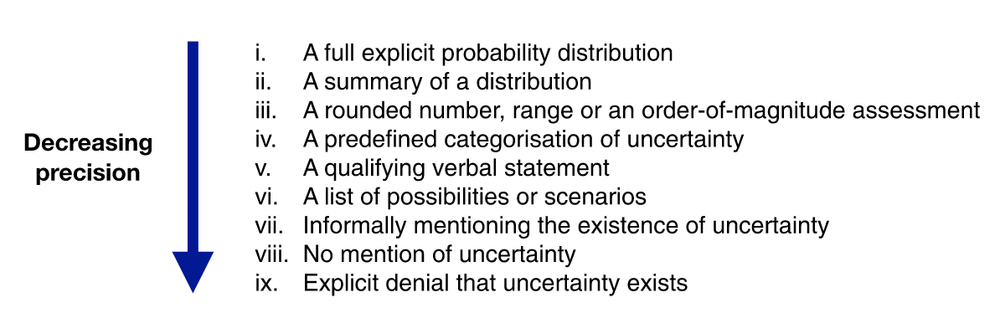
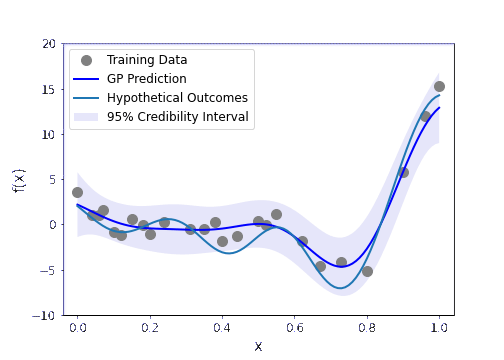
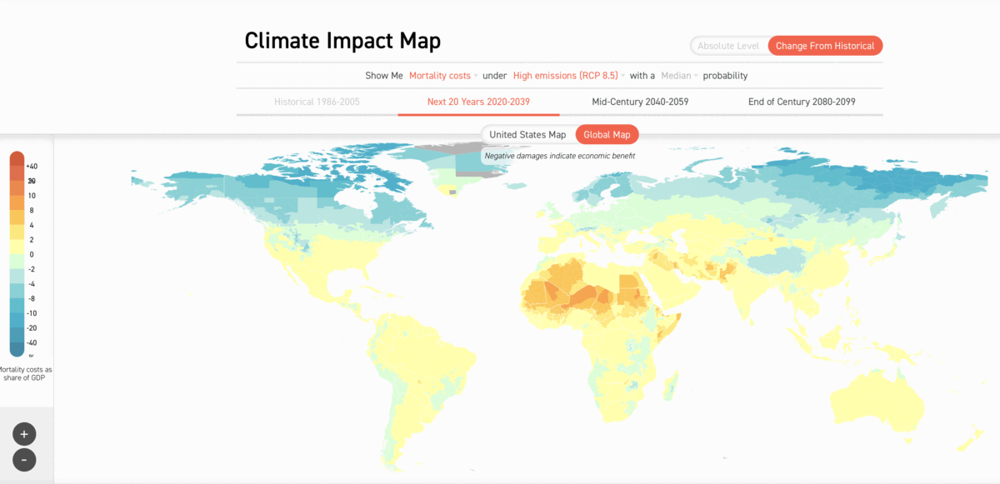

# Communicating Uncertainty

There are many forms of uncertainty that we have to consider when planning and facilitating forms of public engagement.

- There is the *conceptual uncertainty* involved with key terms that are necessary for shared knowledge and understanding (e.g. what does 'intelligence' mean in the context of AI?).
- There is the *normative uncertainty* that is implicated when deliberating about or choosing on the right or best course of action (e.g. citizen juries).
- And, there is the *scientific uncertainty* associated with data analysis, experiments, and scientific knowledge.[^epistemic]

[^epistemic]: We can split this into both *epistemic* and *aleatory* uncertainty, where the former relates to our uncertain knowledge of the world, and the latter refers to fundamental indeterminacy of the world itself. In this section we will only consider the former (i.e. epistemic uncertainty).

In this section, we are just going to look at the final option, but it's good to be aware of the other two.

## The Challenges of Scientific Uncertainty

>Roll up! Roll up! Come and see a true scientific mystery: the marvelous, mystifying marmokreb!

Alright, it's not much to look at, but it is a true scientific mystery in one respect.

As Michael Blastland[@blastland2020] recounts in *The Hidden Half*, the marmorkrebs caused quite the stir in the late 20th Century when it was discovered that lone females were able to lay eggs without fertilisation.
In short, the marmorkrebs did not need to mate, such that offspring were natural clones of their mothers—a process known as *parthogenesis*.
However, it was not the parthogenic property—unique among the ~15,000 species of decapod—that baffled the scientific establishment.
Rather, the mystery lay in what the marbled marmokrebs meant[^tongue] for the nature-nurture debate.

[^tongue]: An optional activity is to see who is the fastest at saying this phrase five times 😉.

Because they were natural clones, the marmokrebs were ideal subjects for an experiment that raised two lineages in identical test conditions, designed to treat the environment as a control condition and investigate how and which genes contribute to observed behaviour or physiological traits.
As Blastland puts it,

> The aim as far as humanly possible was to eliminate every variation that anyone could think of. They were born into the most boring uniformity humans could contrive.

And yet, the following figure shows three marmorkrebs from the same lineage, who were raised in the exact same conditions.

<figure markdown>
  { align="center" }
  <figcaption>A figure of three marmorkrebs displaying significant variation (Reprinted from Vogt et al. 2008)</figcaption>
</figure>

Although the variation in size is striking enough, what is not shown in this image are the many other traits that differed throughout the population, such as distinct marbling or lifespan.
And so it was that these seemingly simple crayfish undermined one of the key assumptions about phenotypic variation: if it isn't genes it's environment; if it isn't the environment it's genes.

At this point, you may be considering possible explanations for the cause of the variation: is it epigenetics, or uncontrolled differences in the marmorkrebs environment that were overlooked by the researchers?
We won't go into each possible causal explanation here, though I do suggest you read Blastland's book in case you find yourself over-confident that you know the answer!
The purpose of mentioning this case of the confounding crayfish is to emphasise that there is a lot in science that we simply do not know.
Sometimes, this uncertainty can be accounted for by following the scientific method and conducting ongoing experimentation.
At other times, the observable phenomena place too much stress on the dominant scientific paradigm, causing the scientific community to rethink core assumptions—a sociological process brought to light by the philosopher of science, Thomas Kuhn.[@kuhn1970]

As researchers and developers trained in the scientific method, you are likely familiar with a variety of methods and tools for navigating scientific uncertainty.
But when it comes to communicating this uncertainty to different stakeholders, the knowledge and understanding of these methods cannot be assumed.
And this can lead to a breakdown in communication and trust.
This is where the systematic framework from van der Bles et al. (2019)[@vanderbles2019] comes in handy.

## A Framework for Communicating Uncertainty

The framework presented in (van der Bles et al., 2019)[@vanderbles2019] is grounded in a review of the, admittedly "scattered" empirical evidence pertaining to the psychological and behaviour effects of communicating uncertainty.
Their framework comprises five stages that are summarised as follows:

1. Who communicates
2. what
3. in what form
4. to whom, and
5. to what effect

Let's (briefly) look at each of these in turn.[^full]

[^full]: See the [original article](https://royalsocietypublishing.org/doi/abs/10.1098/rsos.181870) for further details and a review of the empirical evidence.

### Who

The first stage of their framework directs us to consider who is a) assessing the uncertainty, and b) who is responsible for communicating the uncertainty.
As we will see, this is important for identifying the format of communication when communicating to different audiences (e.g. lay people versus those with technical expertise) but also for assessing credibility of the source reporting the information (e.g. media, scientists, commercial organisations).

### What

A particularly valuable contribution from their framework is the categorisation of *what* the uncertainty pertains to into the following taxonomy:

- Object of uncertainty
    - Facts (e.g. is the uncertainty about a specific event, such as whether there has been a data leak)
    - Numbers (e.g. is the uncertainty about specific quantities or parameters of a model)
    - Hypotheses (e.g. is the uncertainty about an underlying assumption in a scientific theory)
- Source of uncertainty
    - Variability in population being sampled
    - Measurement error
    - Limited knowledge
    - Expert disagreement
- Level of uncertainty
    - Direct (i.e. is the uncertaity about the object itself)
    - Indirect (i.e. is the uncertainty related to the quality of the evidence)
- Magnitude of uncertainty

### In what form

The format used to communicate the uncertainty is likely to affect the audience in a variety of ways (see 'to what effect').
As the following figure indicates, this form is associated with varying levels of precision.

.

Decreased precision is not always undesirable.
For instance, sometimes it represents a worthwhile trade-off between precision and accessibility of communication to a non-technical or time-stretched audience.
However, as the diagram shows, it can sometimes spill over into forms of explicit denial.

### To whom

In [chapter 2](../chapter2/deliberation.md) we saw how the relationship between researchers and the public can embody a variety of communicative values, but also prevent obstacles when imbalances of power arise.
Similar characteristics are present in the framework from van der Bles et al. (2019)[@vanderbles2019].

- characteristics of the audience (e.g. data literacy, relevant demographic variables)
- relationship of the audience to what is being communicated (e.g. skeptical attitude)
- relationship of the audience to the people doing the communication (e.g. trustworthy or credible relationship)

As an example, van der Bles et al. (2019)[@vanderbles2019] cite a study from Dieckmann et al. (2017)[@dieckmann2017] that found evidence of varying responses to ambiguous information about average global surface temperatures.
For audiences, who were more accepting of climate change, they took the information to be evidence of a normal distribution where higher values of surface temperature were likely.
Whereas, for audiences who were less accepting of climate change, the same information was taken to reflect a uniform distribution where lower temperatures were more likely.

### To what effect

The final stage of the framework considers the effect of not knowing, and identifies the following categories based on the extant empirical literature:

- Effect on cognition (e.g. are consistent inferences or judgements elicited from *verbal statements* of uncertainty)
- Effect on emotion (e.g. do uncertainty ranges elicit higher levels of anxiety in specific audience, rather than point estimates)
- Effect on trust (e.g. is perceived over-confidence in the communication of uncertainty likely to build confidence or undermine trust)
- Effect on decision-making (e.g. if uncertainty is communicated, will decision-making be delayed)

The above framework helps to systematise our understanding of uncertainty, which can be very valuable when trying to consider how best to communicate with specific audiences or stakeholders.
However, it also raises the following question:

!!! question "Question"

    Given the wide range of factors involved, and the scattered nature of the empirical evidence, how should researchers choose the best course of action when communicating uncertainty?

There is, again, and unfortunately, no simple answer to this question.
Deciding on the right course of action is likely to be a team effort, and one which considers all of the topics we have covered so far (e.g. goals, values, audience, available methods, time and resources).
There are, however, some interesting tools that link back to the first section in this chapter, which deserve a mention.

=== "Plotting Hypothetical Outcomes"

    

    { align=right width=300 }
    
    One method is to use packages built into software like Python and R to generate visual animations that explicitly depict alternate or hypothetical outcomes alongside, say, the most likely model of the data generation process. See [this page for more details](uncertainty_example.ipynb).

    

=== "Interactive Heat Maps"

    

    { align=left width=50% }

    Heat maps are commonly used for communicating probabilistic information. The [Climate Impact Lab](https://impactlab.org/map/#usmeas=change-from-hist&usyear=2020-2039&gmeas=change-from-hist&gyear=2040-2059&usvar=mortality&tab=global&gvar=mortality) take the traditional heat map a step further though by adding interactivity to allow users to alter variables and see the possible impact that emissions, for example, could have across the globe.

     

=== "Uncertainty.io"

    

    { align=right width=300 }

    Still in need of some creative inspiration? [Uncertainty.io](https://www.uncertainty.io/art/) is a queryable interface to references of more than 400 works of fine art that "have a unique ability to convey uncertainty using a range of approaches and techniques."

    

<!-- ## Cognitive Biases

Our modern understanding of cognitive biases has been most heavily influenced by research conducted by the psychologists Daniel Kahneman and Amos Tversky.

A lot of their work exposed a wide variety of psychological vulnerabilities, which impact our judgement and decision-making capabilities.
For instance, their experiments showed how individuals rely on an assortment of heuristics or biases, which speed up judgement and decision-making but also lead us astray.
To see how, try the following two activities.

=== "The Linda Problem"

    Linda is 31 years old, single, outspoken, and very bright. She majored in philosophy. As a student, she was deeply concerned with issues of discrimination and social justice, and also participated in anti-nuclear demonstrations.
    
    !!! question "Question"
    
        Which is more probable?
    
        1) Linda is a bank teller.
        2) Linda is a bank teller and is active in the feminist movement.

    Try to answer this question yourself, before you reveal the answer.

    ??? note "Reveal"

        The correct answer is (1). Did you get it right?

    If you got it wrong, you have just committed what is known as the 'conjunction fallacy'. But don't worry you're in very good company!
    When Tvserky and Kahneman posed this question to a group of 88 undergraduate students, only $15%$ got the correct answer {cite}`tversky1983`. 
    
    The reason it is (1) is because the probability of two events occurring *in conjunction*, such as Linda being both a 'bank teller' and 'active in the feminist movement' must be less than or equal to the probability of either event occurring on its own. 
    Formally, for two events $A$ and $B$:
    
    $Pr(A \wedge B) ≤ Pr(A)$ and $Pr(A \wedge B) ≤ Pr(B)$
    
    Or, to put it more simply, someone cannot belong to the set of $feminist bank tellers$ without also belonging to the set of $bank tellers$ 👇
    
    
    
    Tversky and Kahneman attributed this systematic error to what is known as the *representativeness heuristic*. 
    In short, people don't think about the conjunction of events or consider probability theory when formulating an answer.
    Instead, their choice is based on which of the two options is *most representative* of the description of Linda. 
    That is, they employ a mental shortcut (or, a heuristic) that in some instances lead to the right answer—hence, their efficiency. However, in in other cases their use lead to mistakes or errors in judgement.

=== "The Wason Selection Task"
    
    In front of you is a set of four cards. Each card has a number on one side and a colour on the other side. The cards are displayed as follows:

    
    
    !!! question "Question"
    
        Using the fewest possible actions, which card(s) must you turn over to test the validity of the following statement: 'If a card shows an even number on one side, the other side will be red"?
    
    ??? note "Reveal"

        The correct answer is to turn over the 8 and the orange.
    
    The question is designed to test a subject's logical reasoning.
    And the simplest way to test the claim is to identify instances that could falsify the statement.
    Turning over the 3 or the red do not achieve this.

    To see why this is the case, consider what turning over these other cards demonstrates.
    If you turn over the 3 and there is a red card, you have not falsified the original statement.
    All you have demonstrated is that odd numbers can also have red on their opposite sides.
    
    Similarly, the red card can show either an odd or even number. If it's even you have found supporting (but redundant) evidence for the claim, and if you see an odd number all you have demonstrated is that the colour red, again, is not exclusive to even numbers.

    The only actions that violate the original statement are if *the 8 is not red* or if *the orange card is even*.

    In Wason's original experiment (1), fewer than 1 in 10 of the participants found the correct answer.
    { .annotate }
    
    1.  P. C. Wason (1968) Reasoning about a rule, The Quarterly Journal of Experimental Psychology, 20:3, 273-281, DOI: [10.1080/14640746808400161](https://journals.sagepub.com/doi/10.1080/14640746808400161)

Experiments like this reveal something important about all human individuals.[^kahneman]
Our judgement and decision-making falls short of the normative standards set by our formal methods and frameworks (e.g. rational choice theory).

In the context of public engagement, this is important for two reasons:

1. When communicating statistical information, there is a risk that your message or results may be affected negatively by a wide variety of cognitive biases.
2. The process of research and development that you communicate to stakeholder may also be impacted by a myriad of cognitive biases (e.g., confirmation bias).

It is beyond the scope of this course to set out all the possible ways in which cognitive (as well as statistical and social) biases can affect the process of research, innovation, and public engagement. However, [see our course on RRI for more details and further resources](../../rri/chapter2/understanding_bias.md).

[^kahneman]: Daniel Kahneman even acknowledged that despite studying congitive biases for the majority of his career, he still finds himself falling prey to their effects. -->
