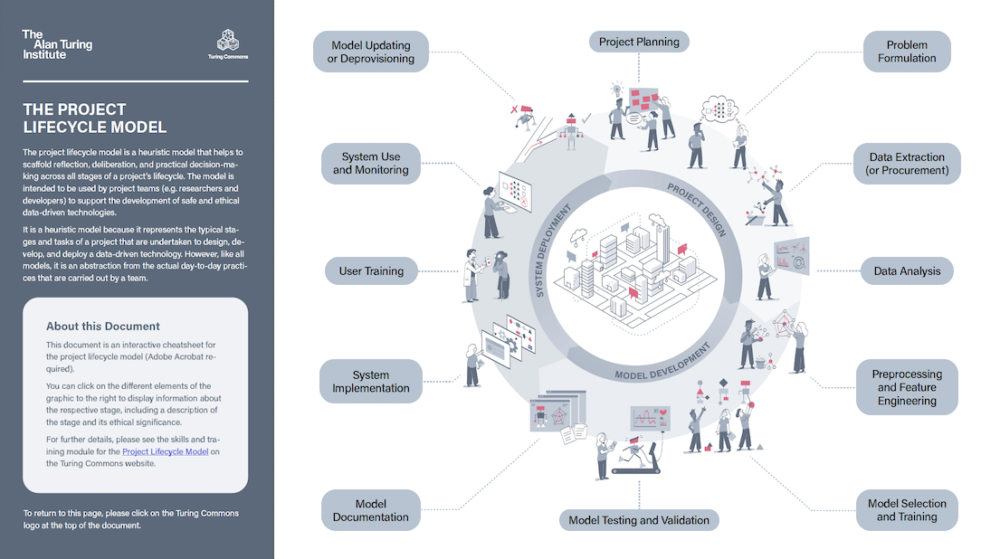
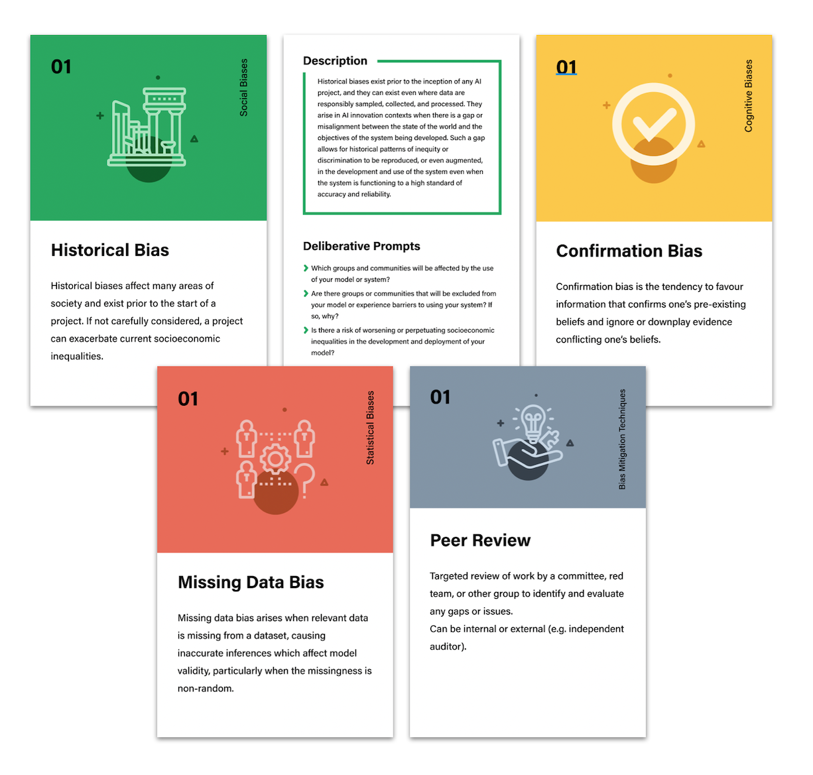

# Activities

!!! info

    On this page you will find a collection of our activities and other materials, which are designed to support either structured workshops or other forms of reflection, deliberation, assessment or general engagement. Some of these activities are designed to accompany our courses and modules. Others are more general purpose.

## General

### Project Lifecycle Model

 {align=right }

The Project Lifecycle is a heuristic model that serves as a "cognitive scaffold" to support the collective reflection, deliberation, and decision-making of teams and organisations throughout the various stages of a project's lifecycle. Why do we call it a "heuristic model"?

We have a [full module that explores the project lifecycle](../skills-tracks/rri/rri-101-index.md), as well as an interactive handout that provides a summary of the model and its constitutive stages. Please note you will need [Adobe Acrobat Reader](https://get.adobe.com/reader/) installed for the interactivity to work.

[Download the Project Lifecycle Interactive PDF](https://github.com/alan-turing-institute/turing-commons/blob/resources/resources/activities/lifecycle-interactive.pdf?raw=true)

### Bias Cards

{ align=right }

This resource is a deck of cards that can be printed (double-sided) and used to identify, evaluate, and mitigate social, statistical, and cognitive biases across the lifecycle of a project (e.g. to build an AI system).

Our module on fairness, includes a [section on the different types of bias](../skills-tracks/rri/rri-203-4.md).

[Download the Bias Cards](https://github.com/alan-turing-institute/turing-commons/blob/resources/resources/activities/bias-and-mitigation-cards.pdf?raw=true)

## Responsible Research and Innovation Skills Track

-   :material-thought-bubble:{ .lg .middle } __Understanding Responsibility__

    ---
    **Module: What is Responsible Research and Innovation?**
    This activity helps participants reflect on a series of scenarios that constitute moral dilemmas. Participants will learn to identify moral agents and moral subjects, consider what the moral responsibilities of the agents are, as well as think about conflicts or interests or values that may arise.

    [:octicons-arrow-right-24: Download](https://github.com/alan-turing-institute/turing-commons/blob/resources/resources/activities/rri-100-a1.pdf?raw=true)

-   :material-graph:{ .lg .middle } __Collective and Distributed Responsibility__

    ---
    **Module: The Project Lifecycle**
    This activity uses the project lifecycle model to get participants thinking about the different remits of responsibility that fall within different stages of the lifecycle. The activity prompts reflection about the upstream and/or downstream dependencies the successful completion of these tasks have, as well as the importance of understanding responsibility as collective and distributed.

    [:octicons-arrow-right-24: Download](https://github.com/alan-turing-institute/turing-commons/blob/resources/resources/activities/rri-101-a1.pdf?raw=true)

-   :material-text-box:{ .lg .middle } __Bias ~~Checklist~~ *Reflect*list__

    ---
    **Module: Fairness (*SAFE-D*)**
    This activity is designed to gte participants to identify and understand how different biases can impact the design, development, and deployment of data-driven technologies. It uses the project lifecycle model as a scaffold, and asks participants to consider how a variety of biases (social, statistical, and cognitive) could enter the project lifecycle and impact downstream decisions and outcomes. It also asks participants to think about tailored strategies for minimising the impact of biases.

    [:octicons-arrow-right-24: Download](https://github.com/alan-turing-institute/turing-commons/blob/resources/resources/activities/rri-203-a1.pdf?raw=true)

-  :material-telescope:{ .lg .middle } __Selecting and Evaluating Claims__

    ---
    **Module: Explainability (*SAFE-D*)**
    
    This activity is designed to identify, understand, and evaluate claims made about a project, data, model, or system in service to providing an explanation to a stakeholder or affected user. You will need to identify the objective of the claims as well as their quality, using a case study as an anchor.

    [:octicons-arrow-right-24: Download](https://github.com/alan-turing-institute/turing-commons/blob/resources/resources/activities/rri-204-a1.pdf?raw=true)
