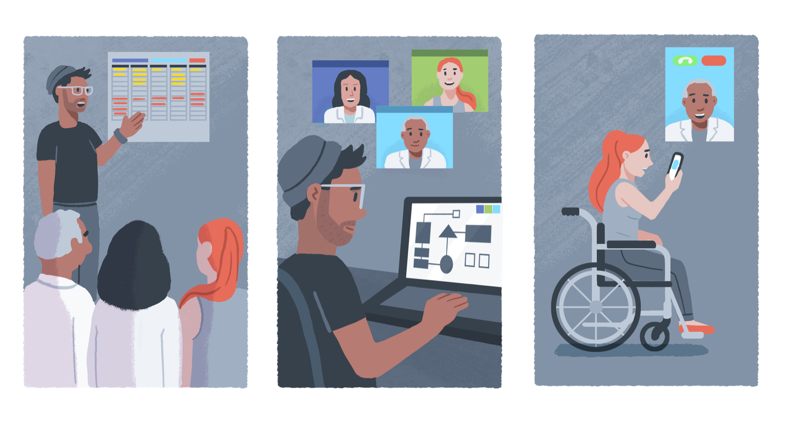

# The Project Lifecycle

<figure markdown>
  { align="center" }
  <figcaption>Illustration by [Johnny Lighthands](https://www.johnnylighthands.co.uk))</figcaption>
</figure>

## Chapter Outline

- [Case Studies](case_studies.md)
- (Project) Design
  - [Project Planning](project_design/planning.md)
  - [Problem Formulation](project_design/problem.md)
  - [Data Extraction or Procurement](project_design/data_extraction.md)
  - [Data Analysis](project_design/data_analysis.ipynb)
- (Model) Development
  - [Preprocessing and Feature Engineering](model_development/preprocessing.md)
  - [Model Selection](model_development/model_selection.md)
  - [Model Training, Testing and Validation](model_development/model_testing.md)
  - [Model Reporting](model_development/model_reporting.md)
- (System) Deployment
  - [Model Productionalisation](system_deployment/model_productionalisation.md)
  - [User Training](system_deployment/user_training.md)
  - [System Use and Monitoring](system_deployment/system_use.ipynb)
  - [Model Updating or Deprovisioning](system_deployment/model_updating.md)
- [Next Steps](summary.md)

!!! abstract "Chapter Summary"

    In this chapter we will work our way through the key stages of the project lifecycle: (project) design, (model) development, and (system) deployment. 
    For each stage, we will describe the accompanying activities, and highlight some of the salient ethical, social, and legal issues. 
    However, this is presented at a relatively high-level of abstraction in the guide, because the material relies heavily on the use of [case studies](case_studies.md) and accompanying activities to flesh out some of the context-specific issues. 
    Therefore, if you are reading this chapter as part of an individual, self-directed study, you may have to adapt the activities a little. 

!!! example "Learning Objectives"

    In this chapter, you will:
    
    - Gain a high-level understanding of the central stages of the project lifecycle: (project) design, (model) development, and (system) deployment.
    - Explore the activities that are associated with each of the three stages, focusing on salient ethical, social, and legal issues.
    - If you are following this material as part of a live course, you will also engage in practical discussions and activities, using several illustrative case studies to help you better understand how to conduct responsible data science and AI.
