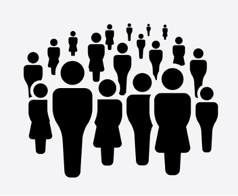

# Widening approaches to data justice research and practice

A second wave of data justice scholarship sought to widen the lens of data justice through intercultural and inclusive approaches.
For instance, Global majority scholars have begun to centre relational notions of personhood and community arising across non-Western systems of belief ranging from Ubuntu[^1], Buddhism[^2], and Confucianism[^3], to various expressions of Indigenous values.

!!! info "Relational notions of personhood and community"

    In “Algorithmic injustice: a relational ethics approach”, Birhane explains: 
    
    “Contrary to the rationalist and individualist worldview, relational perspectives view existence as fundamentally co-existent in a web of relations. Various schools of thought can be grouped under the umbrella of the relational framework with a core commonality of interdependence, relationships, and connectedness. Relational-centered approaches include Black feminist (Afro-feminist) epistemologies, embodied and enactive approaches to cognitive science, Bakhtinian dialogism, ubuntu (the sub-Saharan African philosophy), and complexity science” (2021, p. 3).

Launched in 2021, the [Advancing Data Justice Research and Practice (ADJRP)](https://www.turing.ac.uk/research/research-projects/advancing-data-justice-research-and-practice) project was motivated to contribute to such an agenda.
The project was a collaboration between the Global Partnership on AI (GPAI), The Alan Turing Institute, 12 policy pilot partners, and participants and communities across the globe.
It aimed to offer practical guidance and conceptual framings for expanding understandings of data justice and has led to diverse research outputs, including a three-part documentary series, an in-depth literature review, a repository of case studies, three Data Justice in Practice Guides, and more.
The content of this module is adapted from and builds on the contributions of the ADJRP project.

The following short infographic video gives a brief overview of the ADJRP project.

<iframe width="560" height="315" src="https://www.youtube.com/embed/28UVtRmQsn0?si=1otPqQj5Q1YUBPFA" title="YouTube video player" frameborder="0" allow="accelerometer; autoplay; clipboard-write; encrypted-media; gyroscope; picture-in-picture; web-share" referrerpolicy="strict-origin-when-cross-origin" allowfullscreen></iframe>

The ADJRP project was guided by its effort to reorient data justice research and practice both critically and constructively.
It sought to pave an alternative path to data justice through open and inclusive processes that centre global majority perspectives.
To tackle the reorientation of data justice, the ADJRP project explores the three axes of where, when, and who.

## Where

Broadening the where of data justice does not simply mean a shift in geospatial focus from the global minority to the global majority.
Rather, it shifts attention to the conditions of data injustice that exist between high-income countries or regions and low-and-middle income countries or regions as well as within them.
This approach underlines how patterns of inequality and discrimination that affect Indigenous, marginalised, and vulnerable social groups within low-and-middle income countries or regions are likely only to be magnified by the wider inequalities that exist between these countries or regions and wealthier ones. 

Reorienting the where of data justice, therefore, means recognising body and territorial relationships at both domestic and global levels.
This reorientation seeks to enable more robust interactions between a multiplicity of voices, experiences, and frameworks as well as foster greater cross-fertilisation of insights from divergent sites of experience.

!!! example "Illustrative example: Bhoomi – Land records management system in India"

    Bhoomi is a digital registry of ‘rights, tenancy, and crops’ produced by the state government of Karnataka, India. The registry is part of an open data effort to increase both the uniformity and availability of official records including land-ownership records. While initially developed by the department of revenue for taxation purposes, the information can be viewed publicly online and at internet kiosks. It is reportedly used extensively by real estate developers.
    
    Critics have argued that the Bhoomi registry has disenfranchised members of the Dalit caste, considered to be the lowest class in the social hierarchy system of Hinduism[^4], whose claims are often not documented in official records but are well supported by other means. Research has found that Dalits face discrimination in Indian society and often live in poverty[^5]. They nevertheless have longstanding claims to land. However, the informal and historical knowledge that supports these claims cannot be easily accommodated in the flattened landscape of a relational database, such as the Bhoomi registry, and so are more easily dismissed or overruled.
    
    Furthermore, Bhoomi may be an example of ‘open data under conditions of unequal capabilities’[^6]. Like many digital resources, the Bhoomi registry is more likely to be accessible to people with computational and interpretive skills, who are also more likely to hold greater social and political power in society. In Karnataka, there have been mass evictions of Dalits and others in urban slums that were deemed desirable for redevelopment and in which the ability to present conflicting ownership claims based in local knowledge was diminished by the Bhoomi registry.

## When 

The dimension of when highlights how temporal understandings of data injustice must not be limited to only the past few decades of datafication.
Instead, it is important that understandings of data (in)justice capture longer-term historical patterns.
This entails avoiding the short-sighted and deceptive notion that frames technological development as somehow ‘unprecedented’ or ‘disruptive’, which contributes to obscuring important continuities throughout the past, present, and future of innovation. 

Reorienting the when of data justice aims to situate contemporary occurrences of data risks and harms within broader, ongoing histories of discrimination, inequality, and oppression.

!!! example "Illustrative example: Algorithmic profiling in lending practices, United States"

    Corporate and financial surveillance has extracted and amassed large volumes of data that may be used to economically and racially profile individuals through discriminatory pricing practices. Not only have advertisers made use of behavioural profiling to provide differential pricing for goods, but research also suggests that vulnerable populations are subject to predatory lending practices[^7]. However, variations in lending practices that lead to disparate treatment of social groups predate the use of data-driven technology. For instance, Black and Hispanic borrowers have, in the past, been offered discriminatory sub-prime loans, rates, or excessive fees compared to those offered to equally qualified white borrowers.
    
    Regarded as ‘reverse redlining’, predatory subprime mortgage loans are targeted towards individuals identified as vulnerable, reversing the practice of redlining wherein goods are not made available to minority neighbourhoods[^8]. Non-white, non-wealthy, and less-tech savvy individuals and communities are often disadvantaged through current credit-scoring systems. Subsequent late payments are accepted as objective indicators for credit scoring, despite originating from discriminatory practices. This then feeds forward into a loop that further impacts credit scores.
    
    The equity of impact is dependent on the prevalence of bias in the data and software. While bias in lending is illegal, proxy datasets—available in abundance—and biased correlations can be used in discriminatory practices. Similarly, although exploitative loans are banned or restricted, some lenders continue to operate through online platforms which have actively solicited their advertising. Moreover, when machine learning models lack interpretability, the reasons behind lending practices cannot adequately be presented.

## Who

Reorienting the who of data justice research and practice entails centring the knowledge and lived experience of communities impacted by data injustices.
The notion of data justice has largely been defined and led by academics situated in global minority institutions.
When centring impacted communities, it is worth noting how activism, community organising, and advocacy work that aims to challenge data harms and advance social justice have a longstanding trajectory that precedes (and inspires) the establishment of the term ‘data justice’ itself. 

In this way, rethinking the who of data justice requires amplifying and taking the lead from the perspectives that are rooted in the lived experience of individuals and communities who are impacted by datafication---especially members of those groups which have been historically disempowered and marginalised.

!!! example "Illustrative example: amandla.mobi, South Africa"

    amandla.mobi is an independent, community advocacy organisation run by Black women in South Africa that has developed a petition app for civil society to build support around specific public interest campaigns. Their goal is to mobilise the collective power of Black women from low-income backgrounds, hold political and corporate interests to account, and shift power in ways that laws, policies, norms, and values benefit low- income Black women and their communities. They do this by acting at critical moments in a targeted, coordinated, and strategical way.
    
    Their campaigns relate to a wide range of issues, such as gender-based violence, police brutality, and climate change, and address the power structures that maintain injustices. Campaigns are created considering what the community cares most about and the civic tools and tactics at their disposal. Petitions are then circulated on social media for supporters to sign. One of the campaigns run by amandla.mobi is entitled “Data Must Fall”, which helped to increase access to mobile internet. amandla.mobi achieved this through submissions to the Independent Communications Authority of South Africa (ICASA), protests outside of the high court, amongst other actions, with the goal to reduce mobile networks discriminatory behaviour towards socio-economically marginalised groups, resulting in data prices dropping by 30% to 50%.

[^1]: Birhane, A. (2021). Algorithmic injustice: a relational ethics approach. Patterns, 2(2), 100205. https://doi.org/10.1016/j.patter.2021.100205; Eze, M. O. (2008). What is African communitarianism? Against consensus as a regulative ideal. South African Journal of Philosophy= Suid-Afrikaanse Tydskrif vir Wysbegeerte, 27(4), 386-399. https://doi.org/10.4314/sajpem.v27i4.31526; Gyekye, K. (1992). Person and community in Akan thought. In Wiredu, K., & Gyekye, K. (Eds.), Person and community: Ghanaian philosophical studies. (pp. 101-122). Council for Research in Values and Philosophy; Kalumba, K. M. (2020). A defense of Kwame Gyekye’s moderate communitarianism. Philosophical Papers, 49(1), 137–158. https://doi.org/10.1080/05568641.2019.1684840; Mbiti, J. S. (1970). Concepts of God in Africa. SPCK Publishing; Menkiti, I. A. (1984). Person and community in African traditional thought. In R. Wright (Ed.), African philosophy: An introduction (3rd edition, pp. 171-181). University Press of America; Mhlambi, S. (2020). From rationality to relationality: Ubuntu as an ethical and human rights framework for artificial intelligence governance. Carr Center Discussion Paper Series, 2020(009). https://carrcenter.hks.harvard.edu/files/cchr/files/ccdp_2020-009_sabelo_b.pdf; Ogunbanjo, G. A., & van Bogaert, D. K. (2005). Communitarianism and communitarian bioethics. South African Family Practice, 47(10), 51-53. https://doi.org/10.1080/20786204.2005.10873305

[^2]: Hongladarom, S. (2016). A Buddhist theory of privacy. In A Buddhist theory of privacy (pp. 57-84). Springer.
Hongladarom S., & Ess, C. (Eds.). (2007). Information technology ethics: Cultural perspectives. IGI Global; Vallor, S. (2016). Technology and the virtues: A philosophical guide to a future worth wanting. Oxford University Press.

[^3]: Jing, S., & Doorn, N. (2020). Engineers’ moral responsibility: A Confucian perspective. Science and Engineering Ethics, 26(1), 233-253. https://doi.org/10.1007/s11948-019-00093-4; Wong, P. H. (2012). Dao, harmony and personhood: Towards a Confucian ethics of technology. Philosophy and Technology, 25(1), 67–86. https://doi.org/10.1007/s13347-011-0021-z; Wong, P. H., & Wang, T. X. (Eds.). (2021). Harmonious technology: A Confucian ethics of technology. Routledge; Yu, E., & Fan, R. (2007). A Confucian view of personhood and bioethics. Journal of Bioethical Inquiry, 4(3), 171- 179. https://doi.org/10.1007/s11673-007-9072-3

[^4]: Sankaran, S., Sekerdej, M., & Von Hecker, U. (2017). The role of Indian caste identity and caste inconsistent norms on status representation. Frontiers in psychology, 8, 487. https://www.frontiersin.org/articles/10.3389/fpsyg.2017.00487/full

[^5]: Das, M. B., & Mehta, S. K. (2012). Poverty and social exclusion in India. World Bank. http://hdl.handle.net/10986/26336

[^6]: Johnson, J. A. (2018). Toward information justice: Technology, politics, and policy for data in higher education administration (Vol. 33). Springer. https://link.springer.com/book/10.1007/978-3-319-70894-2

[^7]: Bartlett, R., Morse, A., Stanton, R., & Wallace, N. (2018). Consumer-lending discrimination in the era of fintech. Unpublished working paper. University of California, Berkeley. https://lending-times.com/wp-content/uploads/2018/11/discrim.pdf

[^8]: Gilman, S. (2021). Proliferating predation: Reverse redlining, the digital proliferation of inferior social welfare products, and how to stop it. Harvard Civil Rights- Civil Liberties Law Review (CR-CL), 56, 169.
