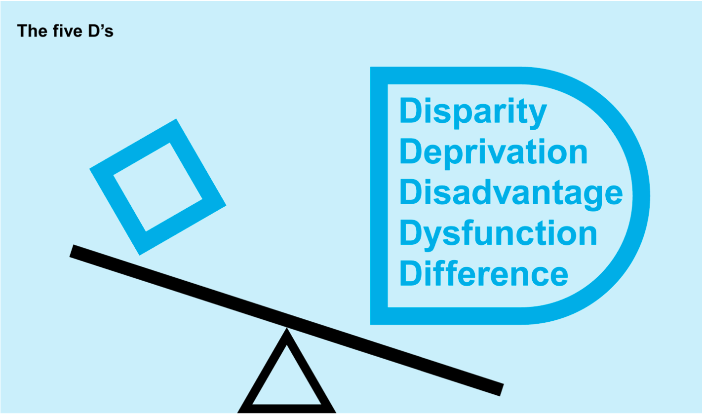

# Equity

_‘Equity' illustration by Johnny Lighthands, Creative Commons Attribution-ShareAlike 4.0 International._

The pillar of equity addresses the need to confront the root causes of data injustices. This pillar also highlights the importance of interrogating the choices that are made about the acquisition and use of data, particularly where the goal or purpose is to target and intervene in the lives of historically marginalised or vulnerable populations.  

The examination of equity in this framework considers four core dimensions: confronting issues of equity at the earliest possible stage of a project, transforming historically rooted patterns of inequity, combatting disadvantage and negative characterisation in data collection, and pursuing measurement justice and statistical equity. The following sections explore each of these elements in detail, offering a framework for investigating concerns of equity in the context of data and data-intensive technologies.  

For a brief overview of the equity pillar, take a look at the infographic video below. 

<iframe width="560" height="315" src="https://www.youtube.com/watch?v=bQtJeG7W4fo&list=PLuD_SqLtxSdVvbwc1cVHf3X3pS1QhFxv2&index=5" title="YouTube video player" frameborder="0" allow="accelerometer; autoplay; clipboard-write; encrypted-media; gyroscope; picture-in-picture; web-share" referrerpolicy="strict-origin-when-cross-origin" allowfullscreen></iframe>

## Confront issues of equity at the earliest stage of the project, before any data are collected or used

The choice to acquire and use data can itself be a question of justice. This decision becomes especially pertinent where the goal or purpose of a data practice is to target and intervene in the lives of historically marginalised or vulnerable populations. Here, the question may not be ‘how can we repair an imperfect system or make it more effective’, but rather ‘does a particular use or appropriation of data enable or disable oppression?’; and ‘does it preserve or combat harmful relations of power?’ A perfectly engineered system employed by an oppressive regime (either governmental or commercial) can facilitate and potentially amplify data injustice. 

## Transform historically rooted patterns of domination and entrenched power differentials 

Data equity demands the transformation of historically rooted patterns of domination and entrenched power differentials. Concerns raised surrounding elements of data innovation practices like data security, data protection, algorithmic bias, and privacy are an important subset of data equity considerations. However, the transformative potential of data equity to advance social justice comes in a step earlier and digs a layer deeper. It starts with questions of how longer-term patterns of inequality, coloniality, and discrimination seep into and penetrate data innovation practices and their governance. Data equity, in this deeper context, is about overhauling power imbalances and forms of oppression that manifest in harmful, unjust, or discriminatory data practices. To realise this sort of equity, those with power and privilege must be compelled to respond to and accommodate the claims of people and groups who have been marginalised by existing political and socioeconomic structures[^1].

!!! example "Illustrative example: Uber 'Movement' Dashboard"

    Platform companies have largely relied on proprietary data and algorithmic systems as intellectual property, which make it possible to avoid explaining platform consequences and decisions at the city-level. This enabled platform companies to make so-called data-powered claims such as Uber stating that its services reduced urban traffic congestion and hence also promoted environmental goals in global cities—a claim they had to finally walk back in 2019[^2]. In the absence of data-sharing programs or regulatory frameworks that mandate data-sharing with governments, academics, and the civil society globally, it has been difficult to engage with or challenge the rhetoric of platform companies. In response, Uber launched the ‘Movement’ dashboard and announced a few partnerships with cities, academics, non-profits, and others in the Global North. Not only has the portal been relatively inactive since its launch but, as researchers have revealed, the dashboard constrains inquiries and hence substantially limits any critical research about gig platforms’ effects on cities[^3].

    Not only this, but Uber also leaned into the ‘data privacy’ narrative in 2019 when the New York City Taxi and Limousine Commission wanted to introduce an amendment requiring ride hailing companies to share more ride data that would then also be publicly available online. Uber, the same company that was exposed and penalised for stalking its consumers through the ‘God’s View’ software[^4], liberally used by its own engineers and data scientists to spy on ex-partners, celebrities, and others, argued, just like Facebook/Meta did with its data-sharing partnerships that beyond a point, granular data activity and identifiers would not allow for companies to retain user anonymity. Importantly, between Global North tech companies and their less powerful oversight bodies, the former certainly has an edge when it comes to maintaining privacy, security, and confidentiality of personal data since these companies have been able to invest in the storage, security, and maintenance infrastructure while the same may not always be possible for a government agency and certainly not so for academics or non-profit actors. This disparity only increases when porting and advocating for data-sharing in service of research and advocacy in global South contexts, with the added risk that in case of a data breach, there may not be robust and realistic recourse to data privacy and protection laws outside of Europe, United States, and Canada.

## Combat discriminatory, racialised, or ‘single axis’ forms of data collection and use that centre on disadvantage and negative characterisation 

Data equity involves confronting and combating statistical representations of marginalised, vulnerable, and historically discriminated against social groups that focus mainly or entirely on measurements of ’disparity, deprivation, disadvantage, dysfunction, and difference’, the ’5 D’s’[^5]. Approaches to statistical measurement and analysis that centre on disadvantage and negative characterisation produce feedforward effects which further entrench and amplify existing structures of inequity, discrimination, and domination. 

_Single axis modes of statistical representation; adopted from the 5 D's presented by Kukutai and Taylor (2016)._

!!! example "Illustrative example: Jordan Open-Source Association (JOSA)"

    Based in the capital city of Amman, the Jordan Open-Source Association (JOSA) is a NPO aimed at promoting openness in technology through free access to non-personal information—such as software, content, network protocols and architecture—as well as the protection of personal information through robust legislation and technological frameworks. 

    Most recently, one of their projects has been aimed at improving the gender gap on Wikipedia with a particular focus on Arab women under the ‘WikiGap Challenge’ [^6]. Wikipedia has played a pivotal role in free access to information through its process of community-led information gathering, editing, and publication. The barriers that may exist to prevent access to relevant information and knowledge on a plethora of themes and subjects are being mitigated through the platform. Notwithstanding debates on using Wikipedia pages as a reliable reference, studies have noted the prevalence of Wikipedia usage and the progress within the platform to promote high-impact journal citations and well-referenced entries[^7]. The platform has increasingly emphasised the necessity and role of open-source journal articles in its editing guidelines. Nevertheless, there exist significant gaps in the available literature with gender being a leading factor of imbalance. Among other projects, JOSA has noted and worked towards minimising the gaps in representation and information on Arab heritage and women through the global Wikigap edit-a-thon[^8]. The organisation’s work includes events (comprising hackathons, public panels, and workshops) alongside the periodic release of blogposts wherein the challenges of censorship, corporate and government surveillance, arbitrary detention, digital rights, and data justice are given a space of prominence.

## Pursue measurement justice and statistical equity

Measurement justice and statistical equity involve focusing on collecting and using data about marginalised, vulnerable, and historically discriminated against communities in a way that advances social justice. It requires using data in ways which draw on their strengths rather than primarily on perceived weaknesses, and approaches analytics constructively with community- defined goals that are positive and progressive rather than negative, regressive, and punitive. This constructive approach necessitates a focus on socially licenced data collection and statistical analysis, on individual- and community-advancing outcomes, strengths-based approaches, and on community-guided prospect modelling[^9].

More proactive research is needed to explore how positive (individual- and community-advancing) outcomes can be integrated into data analytics that involve marginalised, vulnerable, and historically discriminated against communities. Part of developing such prospect assessment models would involve inclusive, community-integrating processes of objective setting, problem formulation, and outcome definition as well as multi-stakeholder and interdisciplinary approaches to model planning and implementation. Through these processes of co-creation, the analytics would come to better reflect the best interests of the communities to which they apply. Exploring the possibilities of strengths-based, prospective approaches would also involve creating a better data landscape capable of capturing the lived experience of impacted communities, as well as patterns indicative of positive outcomes that foster their wellbeing and flourishing. At the same time, those working toward cultivating this data landscape would have to safeguard the interests of affected data- subjects—in particular, those most vulnerable to over-collection and the potential harms of data misuse—by working through privacy-preserving and consent-based programming.

!!! example "Illustrative example: United States Indigenous Data Sovereignty Network"

    The United States Indigenous Data Sovereignty Network was formed in 2016 to ensure that data for and about Indigenous people in the US are used for their individual and collective well-being. Their mission is to decolonise data and exert Indigenous data governance to promote Indigenous data sovereignty, which ‘derives from tribes’ inherent right to govern their peoples, lands, and resources’[^9]. At the international level, they collaborate with the Te Mana Raraunga in Aotearoa New Zealand and the Māori Data Sovereignty Network[^10].

    The network has enabled the creation of a transdisciplinary community of practice and provided research information and policy advocacy. Members have developed research projects together and discussed and released policy papers and recommendations. They call for policymakers to recognise Indigenous data sovereignty as an objective to be incorporated into tribal, federal, and other forms of data policies in order to generate resources and build support for Indigenous data governance and grow tribal data capacities including the development of data warriors (Indigenous professionals and community members who are skilled at creating, collecting, and managing data).

[^1]: D’Ignazio, C., & Klein, L. F. (2020). Data feminism. MIT Press. 

[^2]: Hawkins, A. J. (2019, August 6). Uber and Lyft finally admit they’re making traffic congestion worse in cities. The Verge. https://www.theverge.com/2019/8/6/20756945/uber-lyft-tnc-vmt-traffic-congestion-study-fehr-peers 

[^3]: Uzel, A. (2018, September 5). Putting “Uber Movement” Data into Action — Machine Learning Approach. Towards Data Science.https://towardsdatascience.com/putting-uber-movement-data-into-action-machine-learning-approach-71a4b9ed0acd

[^4]: Welch, C. (2016, January 6). Uber will pay $20,000 fine in settlement over ‘God View’ tracking. The Verge.https://www.theverge.com/2016/1/6/10726004/uber-god-mode-settlement-fine 

[^5]: Kukutai, T., & Taylor, J. (Eds.). (2016). Indigenous data sovereignty: Toward an agenda (Vol. 38). ANU Press.

[^6]: Wikimedians of the Levant/Reports/2020/WikiGap. (2020, December 16). Wikimedia Meta-Wiki. https://meta.wikimedia.org/wiki/Wikimedians_of_the_Levant/Reports/2020/WikiGap 

[^7]: Duede, E. (2015, September 8). Wikipedia is significantly amplifying the impact of Open Access publications. Impact of Social Sciences.https://blogs.lse.ac.uk/impactofsocialsciences/2015/09/08/wikipedia-amplifying-impact-of-open-access/ 

[^8]: Rawashdeh, S. (2019, October 8). ‘Edit-a-thon’ seeks to update online information on Jordanian heritage. Jordan Times.http://www.jordantimes.com/news/local/%E2%80%98edit-thon%E2%80%99%C2%A0seeks-update-online-information-jordanian-heritage  

[^9]: Leslie, D., Holmes, L., Hitrova, C. & Ott, E. (2020). Ethics review of machine learning in children's social care. What works for children's social care. https://whatworks-csc.org.uk/wp-content/uploads/WWCSC_Ethics_of_Machine_Learning_in_CSC_Jan2020_Accessible.pdf 

[^10]: See United States Indigenous Data Sovereignty Network at https://usindigenousdata.org/about-us 

[^11]: Russo Carroll, S., Garba, I., Rodriguez-Lonebear, D., Echo-Hawk, A., & Garrison, N. (n.d.). Enhancing Genomic Research in US Through the Lens of Indigenous Data Sovereignty. https://www.law.nyu.edu/sites/default/files/Stephanie%20Russo%20Carroll.pdf