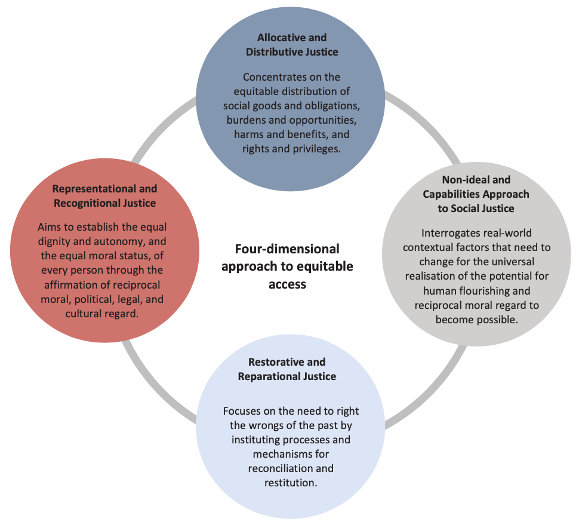
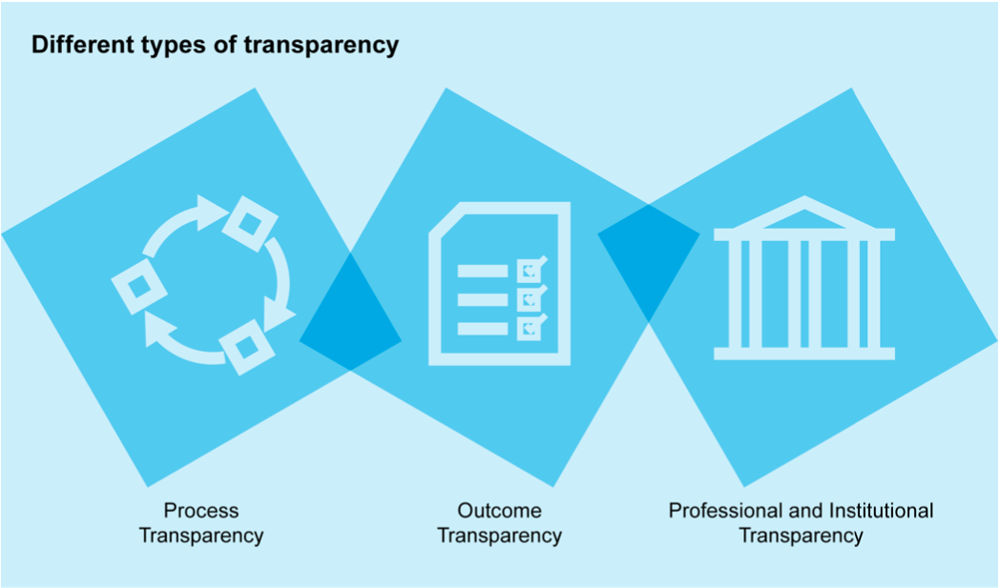

# Access

_‘Access' illustration by Johnny Lighthands, Creative Commons Attribution-ShareAlike 4.0 International._

The pillar of access illuminates how a lack of access to the benefits of data processing is a starting point for reflection on the impacts and prospects of technological interventions. The beginning of any and all attempts to protect the interests of the vulnerable through the mobilisation of data innovation should be anchored in reflection on the concrete, bottom-up circumstances of justice and the real-world problems at the roots of lived injustice.   

The examination of access in this framework considers four main dimensions: confronting material and structural inequality, starting from questions of access and capabilities, adopting a four-dimensional approach to equitable access, and promoting the sharing of data injustices across communities. The following sections explore each of these elements in detail, offering a framework for investigating concerns of access in the context of data and data-intensive technologies.  

For a brief overview of the access pillar, take a look at the infographic video below. 

<iframe width="560" height="315" src="https://www.youtube.com/watch?v=fujZzByFUAk&list=PLuD_SqLtxSdVvbwc1cVHf3X3pS1QhFxv2&index=6" title="YouTube video player" frameborder="0" allow="accelerometer; autoplay; clipboard-write; encrypted-media; gyroscope; picture-in-picture; web-share" referrerpolicy="strict-origin-when-cross-origin" allowfullscreen></iframe>

## Confront real-world problems of material inequality and structural injustice 

Access is about providing people tangible paths to data justice by addressing the root causes of social, political, and economic injustice. Existing sociohistorical, economic, and political patterns of disadvantage must be taken as the starting point for reflection on the equitable access, because these create material conditions of injustice and a lack of access to the benefits of data processing. The beginning of any and all attempts to expand equitable access should be anchored in reflection on the concrete, bottom-up circumstances of justice, in its historical and material preconditions. Combatting the real-world problems at the roots of lived injustice should be a first priority. 

!!! example "Illustrative example: Body & Data, Nepal"

    Body & Data was set up in Nepal in 2017 with the objective of improving understanding and access to information for women, queer people, and marginalised groups within the digital space. The organisation primarily conducts legal research and analysis, workshops to improve digital rights and safety, and advocacy programmes at the intersection of feminist and digital rights spaces. 

    The organisation has worked to produce guidelines for an inclusive and intersectional Nepali language[^1].  This working document approaches the role of data privacy through a critical feminist lens. With a goal to improve accessibility and safety in digital spaces, the organisation has also mapped out relevant legislation on gender-based online violence. They are likewise working to improve understanding of Nepal’s Information Technology Bill by providing specific critiques on the implications of surveillance on the freedom of sexual minorities and marginalised communities. Their most recent publications include an evaluation of the harms of misinformation in the COVID-19 pandemic. This evaluation also includes an analysis of the mechanisms needed to mitigate further proliferation of misinformation through fact-checking tools and impact assessments which consider the needs of marginalised or vulnerable minority groups.

## Start from questions of access and capabilities

Beyond the critical demand to advance ‘access to representation’, data justice thinking must focus on equitably opening access to data through responsible data sharing; equitably advancing access to research and innovation capacity; equitably advancing access to the benefits of data work; and equitably advancing access to capabilities to flourish.  

### Equitably open access to data through responsible data sharing 

Calls for ’open data’ sometimes run the risk of oversimplification and appropriation by market forces which could end up curtailing equitable access. The concept of ’open data’ itself must be bounded and qualified. At all times, those who share data ought to remain critically aware of the moral claims and rights of the individuals and communities where the data came from, of the real-world impacts of data sharing on those individuals and communities, and of the practical barriers and enablers of equitable and inclusive research. There is also a need to consider the right of communities to access and benefit from the use of their data. Building on this, community-rights based approaches to data access and data sharing should include a strong participatory component. Here equitably opening access to community data entails the democratic governance of data collection and use as well as robust regimes of social license and public consent. 

!!! example "Illustrative example: Challenges to data sharing and open data, Africa"

    Within the Western scientific community, the calls for data sharing and open data have been gaining momentum. Data sharing is often regarded as a hallmark of transparency, scientific advancement, and generally a good practice that contributes to better science. These Western based initiatives for data sharing and open data also find their way into the African continent. While data sharing and open data indeed open opportunities for better science, a justice-oriented approach to data sharing/open data practices recognises that such practices are highly complex and contentious issues[^2].

    Without careful consideration and mitigation of concerns such as unjust historical pasts, structural challenges, colonial legacies, and uneven power structures, such initiatives risk exacerbating existing inequalities and benefiting the most powerful stakeholders[^2].“Parachute research”, the practice of Global North researchers absconding with data to their home countries, for example, is one of the concerns that arise with open data in the absence of safeguards that protect data workers (data collectors, data subjects, and other individuals and groups that deal with the task of data management and documentation)[^2]. Without safeguards in place, non-African researchers not only benefit from African generated data, but they are also afforded the opportunity to narrate African stories—at times contributing to deficit narratives. In a systematic review that examined African authorship proportions in the biomedical literature published between 1980 – 2016 where research was originally done in Africa, scholars found that African researchers are significantly under-represented in the global health community, even when the data originates from Africa[^3].

### Equitably advance access to research and innovation capacity

Long-standing dynamics of global inequality may undermine reciprocal sharing between research collaborators from high-income countries (HICs) and those from low-/middle-income countries (LMICs). Given asymmetries in resources, infrastructure, and research capabilities, data sharing between LMICs and HICs, and the transnational opening of data, can lead to inequity and exploitation. Moreover, data originators from LMICs may generate valuable datasets that they are then unable to independently and expeditiously utilise for needed research, because they lack the aptitudes possessed by scientists from HICs, who are the beneficiaries of arbitrary asymmetries in education, training, and research capacitation. In redressing these access barriers, emphasis must be placed on ‘the social and material conditions under which data can be made useable, and the multiplicity of conversion factors required for researchers to engage with data’. Equalising know-how and capability is a vital counterpart to equalising access to resources, and both together are necessary preconditions of just data sharing. Data scientists and developers engaging in international research collaborations should focus on forming substantively reciprocal partnerships where capacity-building and asymmetry-aware practices of cooperative innovation enable participatory parity and thus greater research access and equity. 

### Equitably advance access to the capabilities of individuals, communities, and the biosphere to flourish 

This involves prioritising individual, social, and planetary well-being as well as an understanding that the attainment of well-being necessitates the stewardship of the human capabilities that are needed for all to freely realise a life well-lived. A capabilities- and flourishing-centred approach to just access demands that data collection and use be considered in terms of the affordances they provide for the ascertainment of well-being, flourishing, and the actualisation of individual and communal potential for these. It demands a starting point in ensuring that ‘practices of living’ enable the shared pursuit of the fullness, creativity, harmony, and flourishing of human and biospheric life (what Abya Yala Indigenous traditions of Bolivia and Ecuador have called ‘living well’ or sumak kawsay in Quechua, suma qamaña in Aymara, or buen vivir in Spanish). 

## Adopt a four-dimensional approach to confronting questions of equitable access 

_Four-dimensional approach to equitable access._

Concerns with equitable access should:  
- Concentrate on the equitable distribution of the harms and benefits of data use. This is the dimension of distributive justice.  
- Examine the material preconditions necessary for the universal realisation of justice. This is the dimension of capabilities-centred social justice.  
- Rights the wrongs of the past so that justice can operate as a corrective dynamic in the present. This is the dimension of restorative and reparational justice.  
- Rectify the identity claims of those who have faced representational injury. This is the dimension of representational and recognitional justice.  

This four-dimensional approach to equitable access should use the ethical tools provided by the principles of social justice to assess the equity of existing social institutions, while also interrogating the real-world contextual factors that need to change for the universal realisation of the potential for human flourishing and reciprocal moral regard to become possible. It should likewise enable the reparation of historical injustices by instituting processes and mechanisms for reconciliation and restitution. While the first three of these facets remain integral to the advancement of access as it relates to data justice research and practice, they tend to focus primarily on addressing present harms and making course corrections oriented to a more just future. Restorative justice reorients this vision of the time horizons of justice. It takes aim at righting the wrongs of the past as a redeeming force in the present.  

## Promote the airing and sharing of data injustices across communities through transparency and data witnessing 

Datafication makes possible the greater visibility of everyday social experience. It has been argued that this expanded visibility is a ‘double-edged sword’ that calls for a balancing of ‘the need to be counted, and thus potentially served and represented, against the potential for the abuse of power over those who are identified and monitored’[^4].  However, increasing visibility should also be harnessed in positive ways to promote emancipatory transformation by exposing lived injustices, historical abuses, and moral harms[^5]. The growth of a networked and connected global society multiplies the transformative power of observation and communication, enabling the far-reaching airing and sharing of previously hidden inequities and mistreatment. The witnessing of injustice both through proximate data work and through the employment of digital media at-a-distance should be marshalled as a force for change and as an opportunity to expand justice by means of transparency and voice.  

_Various types of transparency._

The role of transparency in the airing and sharing of potentially unjust data practices must also be centred. Transparency extends both to outcomes of the use of data systems and to the processes behind their design, development, and implementation. 

#### Process transparency

Process transparency requires that the design, development, and implementation processes underlying the decisions or behaviours of data systems are accessible for oversight and review so that justified public trust and public consent can be ascertained. 

#### Outcome transparency

Outcome transparency demands that stakeholders are informed of where data systems are being used and how and why such systems performed the way they did in specific contexts. Outcome transparency therefore requires that impacted individuals can understand the rationale behind the decisions or behaviours of these systems, so that they can contest objectionable results and seek effective remedy. Such information should be provided in a plain, understandable, non-specialist language and in a manner relevant and meaningful to those affected. 

#### Professional and institutional transparency

Professional and institutional transparency requires that, at every stage of the design and implementation of a project, responsible team members should be identified and held to rigorous standards of conduct that secure and maintain professionalism and institutional transparency. These standards should include the core, justice-promoting values of integrity, honesty, and sincerity as well as positionality-aware modes of neutrality, objectivity, and impartiality. All professionals involved in the research, development, production, and implementation of data-intensive technologies are, first and foremost, acting as fiduciaries of the public interest and must, in keeping with these core justice-promoting values, put the obligations to serve that interest above any other concerns.

!!! example "Illustrative example: 7amleh - The Arab Centre for the Advancement of Social Media, Palestine"

    Rooted in a mission to create a free and fair digital space for Palestine, 7amleh—The Arab Center for the Advancement of Social Media was set up as a NPO that advocates, provides training, and produces research on digital rights, activism, and security capacity-building for Palestinians. Numerous instances of digital violations recorded by 7amleh have catalysed efforts to monitor the violations and provide avenues to limit the moderation of Palestinian content on social media. 

    7amleh’s research in 2021 has focused on digital surveillance in East Jerusalem, the perception of Palestinian CSOs, assessment of digital performance, hate speech, privacy and data protection, guides for journalists, and digital rights abuses. The organisation has also submitted statements on digital rights violations and digital erasure of Palestinians to both international agencies like the UN and European Union as well as technology companies[^6]. 7amleh has campaigned against Google in opposition to its failure to label Palestine on maps as well as against Facebook for its disproportionate and harmful moderation of Palestinian content on the platform[^7]. Maintaining the importance of journalism in reporting digital rights violations in the region and worldwide, 7amleh has provided a detailed guide for journalists which highlights the importance of diversifying resources, upholding the safety of individuals, and providing a platform for the unheard[^8].

[^1]: ody & Data. (2020). ब�ड एणि्◌ ि◌◌ाटामा नपेाल� भाषाको समावेशी तथा मैत्रीपणर् भाषाको प्रयोग सम्बन्धी साझा बझु ◌ाई. https://bodyanddata.org/wp-content/uploads/2020/06/Nepali-Language-Guide.pdf 

[^2]: Abebe, R., Aruleba, K., Birhane, A., Kingsley, S., Obaido, G., Remy, S. L., & Sadagopan, S. (2021). Narratives and counternarratives on data sharing in Africa. In Proceedings of the 2021 ACM conference on fairness, accountability, and transparency (pp.329-341).https://dl.acm.org/doi/abs/10.1145/3442188.3445897 

[^3]: Mbaye, R., Gebeyehu, R., Hossmann, S., Mbarga, N., Bih-Neh, E., Eteki, L., Thelma, O., Oyerinde, A., Kiti, G., Mburu, Y., Haberer, J., Siedner, M., Okeke, I. & Boum, Y. (2019). Who is telling the story? A systematic review of authorship for infectious disease research conducted in Africa, 1980–2016. BMJ global health, 4(5), e001855. https://gh.bmj.com/content/4/5/e001855 

[^4]: Martin, A., & Taylor, L. (2021). Exclusion and inclusion in identification: Regulation, displacement and data justice. Information Technology for Development, 27(1), 50-66. https://doi.org/10.1080/02681102.2020.1811943 

[^5]: Gray, J. (2019). Data witnessing: Attending to injustice with data in Amnesty International’s Decoders project. Information, Communication & Society, 22(7), 971- 991. https://doi.org/10.1080/1369118X.2019.1573915 

[^6]: Circulated by the Security General in accordance with Economic and Social Council resolution 1996/31; A/HRC/47/NGO/2021 

[^7]: 7amleh. (2020a, July 20). Join the Twitter Storm on Google Maps this Wednesday, 22nd July at 8pm Palestine time. https://7amleh.org/2020/07/20/join-the-twitter-storm-on-google-maps-this-wednesday-22nd-july-at-8pm-palestine-time 

[^8]: 7amleh. (2021, June 24). Reporting Digital Rights: Guide for Journalists on Reporting Digital Rights Issues. https://7amleh.org/2021/06/24/reporting-digital-rights-guide-for-journalists-on-reporting-digital-rights-issues 

