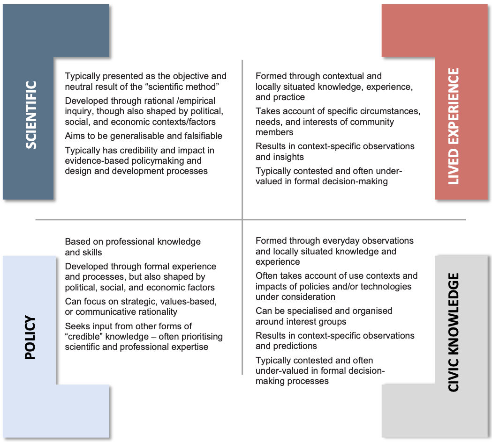

# Knowledge

_‘Knowledge' illustration by Johnny Lighthands, Creative Commons Attribution-ShareAlike 4.0 International._

The pillar of knowledge underlines the need to recognise that diverse forms of knowledge and understanding can add valuable insights to the aspirations, purposes, and justifications of data use—including on the local or context-specific impacts of data-intensive innovation. Inclusion of diverse knowledges and ways of being can open unforeseen paths to societal and biospheric benefits and maximise the value and utility of data use across society in ways which take account of the needs, interests, and concerns of all affected communities. 

The examination of knowledge in this framework considers five core dimensions: embracing the pluralism of knowledges, challenging the unquestioned authority of ‘expertise’, prioritising interdisciplinarity, pursuing reflexivity, and cultivating intercultural sharing, learning, and wisdom. The following sections explore each of these elements in detail, offering a framework for investigating concerns of knowledge in the context of data and data-intensive technologies.  

For a brief overview of the knowledge pillar, take a look at the infographic video below.

<iframe width="560" height="315" src="https://www.youtube.com/watch?v=pRm-EJ0nXko&list=PLuD_SqLtxSdVvbwc1cVHf3X3pS1QhFxv2&index=8" title="YouTube video player" frameborder="0" allow="accelerometer; autoplay; clipboard-write; encrypted-media; gyroscope; picture-in-picture; web-share" referrerpolicy="strict-origin-when-cross-origin" allowfullscreen></iframe>

## Embrace the pluralism of knowledges 

Different communities and sociocultural groups possess unique ways of seeing, understanding, and being in the world. This plurality of knowledges and of lived experience should inform and be respected in practices of data collection, processing, and use as well as in the policymaking practices surrounding the governance of data technologies. Embracing the pluralism of knowledges involves recognising that diverse forms of knowledge, and ways of knowing and understanding, can add valuable insights to the aspirations, purposes, and justifications of data use—including on the local or context-specific impacts of data-intensive innovation. Moreover, inclusion of diverse knowledges and ways of being can open unforeseen paths to societal and biospheric benefits and maximise the value and utility of data use across society in ways which take account of the needs, interests, and concerns of all affected communities.  

!!! example "Illustrative example: Coconet, Southeast Asia"
    
    Since its launch in 2019, Coconet serves a dual function as a both a mechanism for network building and a platform for digital rights. The organisation works in collaboration with EngageMedia and the Association for Progressive Communications among others. Coconet aims to accelerate the digital rights movement in the Asia-Pacific by focusing on the role of the internet in discussion and dissent in the region.
    
    Digital and internet spaces have, in recent times, been subject in Southeast Asia to increasing surveillance, censorship, deterioration of freedoms and rights, and incidents of false or misleading information. In response to this, Coconet works to provide tools and strategies to effectively use cyberspace for advocacy and activism while improving equitable access to research and content on related themes of digital hygiene and AI. Coconet publications have focused on the harms and impacts of multifarious legislation within the states of South-East Asia. For instance, they have provided detailed research on Myanmar’s draft Cyber Security Law which will empower the government to enact internet shutdowns and increase military control and oversight of the internet[^1]. Another example is the case of Indonesia’s Ministerial Regulation 5 (MR5) which has the potential for ‘prepublication censorship’. Importantly, Coconet’s community-driven platform is working toward providing multilingual resources for data justice advocacy and activism. 

## Challenge the assumed or unquestioned authority of technical, professional, or “expert” knowledge across scientific and political structures 

Processes of knowledge creation in data science and innovation are social processes which require scrutiny and wider public engagement to hold “expertise” to account and to ensure that data science and innovation progress in ways which align with wider societal values. This means that data technology producers and users have a responsibility to communicate plainly, equitably, and to as wide an audience as possible. Clear and accessible public communication of research and innovation purposes/goals and data analytic and scientific results should enable the public to interrogate the claims and arguments being put forward to justify data-driven decision-making and data innovation agendas. This also means that members of the public have a corollary responsibility to listen to—i.e. to pay attention to, engage with, and critically assess – the scientifically authoritative knowledge claims and technological systems that impact them.  

!!! example "Illustrative example: Nupef, Brazil"
    
    The Instituto Nupef is an NPO in Brazil established in 2019 that aims to generate conditions for the effective use of technology to defend democracy and fundamental rights. Nupef produces research and learning activities for different stakeholders about the potentials of ICTs to enhance citizens’ participation and the promotion of digital rights, implements pilot projects for innovation, and advocates for policies and practices that range from privacy to an open spectrum (an approach to radio spectrum management where unlicensed spectrum is available for use by all). 
    
    To integrate and expand the knowledge about existing practices of innovative uses of ICT that support sustainable development, human rights, and social justice, Instituto Nupef launched “Espectro” (translated as “Spectrum”). Espectro is a collaborative and multieditorial web portal created by Nupef with the aim of sharing information and knowledge on network practices pertaining to new radio technologies for community use, encouraging the innovative use of information and communication technologies to support sustainable development, human rights, social justice, good governance, and democratic values. Content on the Espectro platform includes the monitoring of community experiments and information on regulation and the effective implementation of ICT projects. 

## Prioritise interdisciplinarity 

Approach the pursuit of understanding of data innovation environments—and the sociotechnical processes and practices behind them—through a holistically informed plurality of methods. This involves placing a wide range of academic disciplines and specialised knowledges conceptually on par, enabling an appreciation and integration of a wide range of insights, framings, and understandings. Ways of knowing that cannot (or are not willing to) accommodate a disciplinary plurality of knowledgeable voices that may contribute to richer comprehensions of any given problem cease to be knowledgeable per se.  

!!! example "Illustrative example: InternetLab, Brazil"
    
    InternetLab is a non-profit research centre based in Brazil that conducts interdisciplinary research about internet policy. More specifically, their research agenda includes issues of privacy and surveillance, culture and knowledge, freedom of speech, information and politics, gender, and technology. Its mission is to create and disseminate knowledge about internet policy and to support related initiatives and research projects. For this reason, they engage with other stakeholders across the globe who are working on related fields. 
    
    Among its projects, InternetLab has evaluated automated content moderation tools by social media platforms. In their research “Drag Queens and Artificial Intelligence”, InternetLab has studied Perspective, the AI technology developed by Jigsaw from Alphabet Inc., that assigns a level of “toxicity” to text-based content. Results showed ‘that a significant number of drag queen Twitter accounts were considered to have higher perceived levels of toxicity than those of Donald Trump and white supremacists[^2]. Words, such as ‘gay’, ‘lesbian’, and ‘queer’, despite their context, were associated with “toxic” content. The lack of neutrality in this approach was highlighted by InternetLab as problematic for the exercising of the right to freedom of expression. 
    
    InternetLab has also participated in a project titled “Policy Frameworks for digital platforms—moving from openness to inclusion.” This research explores the juridical-institutional arrangements that regulate digital platforms. It also identifies emerging issues including market monopolisation, challenges to development justice, ownership of user data, privatisation of informational commons, and worker exploitation. Based on its unpacking of these issues, the project proposes policies that may address such challenges while considering inclusion and socio-economic development. InternetLab is conducting a case study on the regulation of on- demand videos, investigating the impact of the platform economy on the Brazilian audiovisual market as this pertains to user access, available content, and the financial contributions to the State

## Pursue a reflexive and positionally aware objectivity that amplifies marginalised voices 

A robust approach to objectivity demands that knowers have positional self-awareness, which acknowledges the limits of everyone’s personal, historical, and cultural standpoint. It also demands that knowers carry out critical and systematic self-interrogation to better understand these limitations. This launching point in reflexive and positionally aware objectivity can end up leading to more objective and more universalistic understandings than modes of scientific or technical objectivity which stake a claim to unobstructed neutrality and value-free knowledge that evades self-interrogation about the limits of standpoint and [positionality](../aeg/chapter3/engagement.md). One reason for this has to do with power dynamics. Reflexive and positionally aware objectivity starts from a reflective recognition of how differential relations of power and social domination can skew the objectivity of deliberations by biasing the balance of voices that are represented in those deliberations. It then actively tries to include and amplify marginalised voices in the community of inquiry to transform situations of social disadvantage where important perspectives and insights are muted, silenced, and excluded into situations that are scientifically richer and more advantaged. Such richer and more inclusive ecologies of understanding end up producing more comprehensive knowledge and more just and coherent practical and societal outcomes. Reflexive and positionally aware objectivity amplifies the voices of the marginalised, vulnerable, and oppressed as a way to overcome claims of objectivity, impartiality, and neutrality that mask unquestioned privileges[^3] [^4].

## Cultivate intercultural sharing, learning, and wisdom 

A plurality of insights, learning, and wisdom from a diverse range of communities and sociocultural groups should inform the values, beliefs, and purposes behind data research and innovation agendas and practices. Cultivating intercultural sharing, learning, and wisdom serves this end by bringing a multitude of ideas and perspectives into conversation. This involves setting up and sustaining networks of communication and collaboration between communities and sociocultural groups, so that they can come together to cultivate shared understandings and constructively explore differences. At the same time, cultivating intercultural sharing, learning, and wisdom as a way to advance data justice involves drawing on the principles and priorities of social justice to find commonality and to build solidarity among communities and sociocultural groups.

_Pluralism of knowledges._

!!! example "Illustrative example: iFreedom, Uganda"
    
    The weaponising of the internet against LGBTQI+ and Sex Workers (SW) in Uganda was found to have severe consequences for these marginalised communities’ offline and online freedoms and rights, including those to freely associate and express themselves without fear of threats posed by state agencies and hackers[^5]. Consequently, five LGBTQI+ and two SW organisations came together to establish the iFreedom network to defend digital rights and freedoms alongside the protection of security and safety in 2012. Since then, the network has grown to include 28 organisations—categorised into LGBTQI+, SW, and other human rights defenders—all of whom share a common goal of promoting digital rights and freedoms through research, advocacy, and digital knowledge capacity-building. 
    
    Beyond research and advocacy activities, the organisation also provides IT support, web design and hosting services, and computer training programmes. The training programmes are primarily catered towards sex workers regardless of their levels of skill. Beginning with a fundamental computer training phase, participants can then move to more complex digital security training, thereby contributing to the growth of an environment of informed and skilled sexual minorities and sex workers. Even amidst the many instances of violence and persecution of sexual minorities in Uganda, the organisation has become critical for equipping marginalised communities with the skills needed to defend themselves and progress in an increasingly digital world. 

[^1]: Coconet. (2021a, February 24). #WhatsHappeningInMyamnmar: Six risks from Myanmar’s draft Cyber Security Law. Coconet. https://coconet.social/2021/myanmar-cyber-security-law/index.html

[^2]: InternetLab. (2019). Drag Queens and Artificial Intelligence. https://internetlab.org.br/en/projetos/drag-queens-and-artificial-intelligence/ 

[^3]: Haraway, D. (1988). Situated knowledges: The science question in feminism and the privilege of partial perspective. Feminist Studies, 14(3), 575-599. https://www.jstor.org/stable/3178066?seq=1#metadata_info_tab_contents 

[^4]: Harding, S. G. (1992). Rethinking standpoint epistemology: What is "strong objectivity?" The Centennial Review, 36(3), 437–470.  

Harding, S. G. (1995). “Strong objectivity”: A response to the new objectivity question. Synthese, 104(3), 331–349. https://doi.org/10.1007/BF01064504 

Harding, S. G. (2008). Sciences from below: Feminisms, postcolonialities, and modernities. Duke University Press. https://doi.org/10.1215/9780822381181 

Harding, S. G. (2015). Objectivity and diversity: Another logic of scientific research. The University of Chicago Press. https://doi.org/10.7208/9780226241531 

[^5]: Amnesty International. (2020, May 18). Uganda’s new anti-human rights laws aren’t just punishing LGBTI people. https://www.amnesty.org.uk/uganda-anti-homosexual-act-gay-law-free-speech 

Unwanted Witness. (2015, April 28). For LGBT Ugandans, physical security threats often translate into digital threats and vice versa. Unwanted Witness. https://www.unwantedwitness.org/for-lgbt-ugandans-physical-security-threats-often-translate-into-digital-threats-and-vice-versa/ 

 

 

 