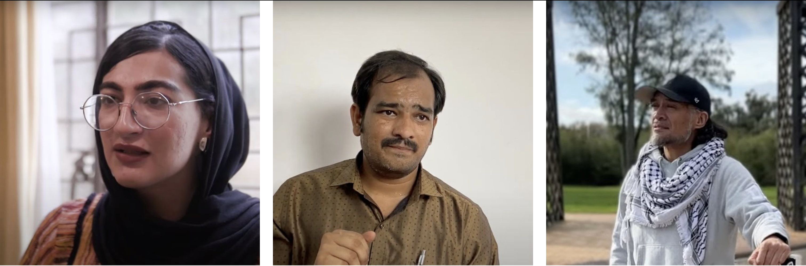

# Documentary series

_Snapshots from the three-part documentary series._

The previous chapters have introduced the [data justice movement](dj-100-index) and have delved into how this effort can be advanced in inclusive and intercultural ways through the critical considerations raised by the [Six Pillars of Data Justice](dj-101-index). This chapter expands on the theoretical foundations and illustrative examples provided previously by exploring instances of data justice in action through a range of grassroots initiatives that are being undertaken by impacted communities across the world. You will be hearing directly from individuals and communities that have been impacted by unequitable data practices and learn more about how they have been mobilising to challenge these. 

!!! note "Keep In Mind"

    As demonstrated by the following initiatives, marginalised communities have been facing and mobilising against data injustices—along with wider, systemic inequalities—long before the term ‘data justice’ was coined within academic circles. It is important to recognise the longer-term histories of discrimination, inequality, and oppression that continue to inform present day experiences of harm within the context of data-intensive technologies.  

As part of the ADJRP project, we collaborated with 12 policy pilot partners to develop a three-part data justice documentary series that closely examines the ongoing activism and advocacy work these civil society organisations are undertaking. These 12 organisations (listed below) have an extensive history of working closely alongside their local communities to expose and challenge ongoing data injustices. Their crucial perspectives, experiences, and approaches are captured through the following three episodes – ‘Introducing Data Justice’, ‘Uncovering Data Injustice’, and ‘Mobilising for Data Justice’. 

- AfroLeadership (Yaoundé, Cameroon)​ 
- CIPESA (Kampala, Uganda)​ 
- CIPIT (Nairobi, Kenya)​ 
- Digital Empowerment Foundation (Delhi, India)​ 
- Digital Natives Academy (Aotearoa, New Zealand)​ 
- Digital Rights Foundation (Lahore, Pakistan)​ 
- EngageMedia (Melbourne, Australia)​ 
- Gob_Lab UAI (Santiago, Brazil)​ 
- Internet Bolivia (La Paz, Bolivia)​ 
- ITS Rio (Rio de Janeiro, Brazil)​ 
- Open Data China (Shanghai, China)​ 
- WOUGNET (Kampala, Uganda) 

    