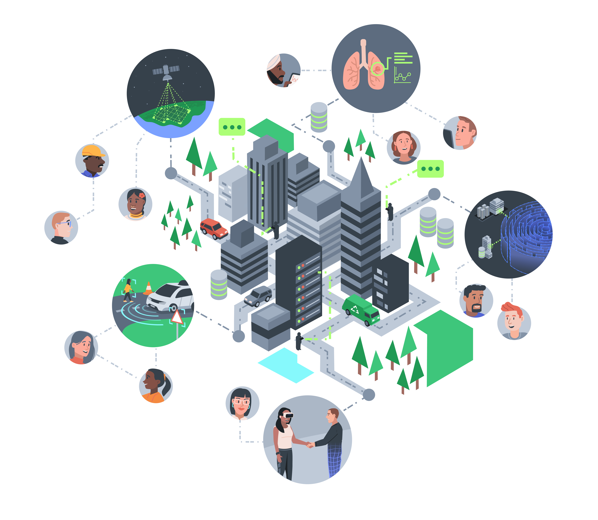

---
hide:
  - navigation
  - toc
---

<figure markdown>
  { width=500 }
</figure>

# Welcome 👋

Welcome to the Turing Commons—a home for resources and tools to help you reflect, discuss, and take responsibility for the design, development, and use of data-driven technologies.
On this site you will guidebooks, activities, case studies, blog posts, and more.
All of these resources have been designed to help you develop the skills and knowledge you need to be a responsible data scientist, data engineer, or data science leader.

This site is a living resource, however, which means the content is constantly being updated, revised, and refined.
At present, the resources centre upon three skills tracks that focus on the following broad topics:

- Responsible Research and Innovation (RRI)
- Public Engagement of Data Science and AI (PED)
- AI Ethics & Governance (AEG)

➡️ Head on over to our [Skills Tracks page](skills-tracks/index.md) to learn more about each of these tracks and the resources available.

## Target Audience 🎯

At present, our resources are primarily aimed at academic researchers and data science professionals who are interested in developing their skills in responsible data science and AI.
As such, they assume a certain level of technical expertise and familiarity with data science and AI.

However, we are always looking to expand the resources available on this site, so if you have any suggestions for new content that you think we should prioritise, please let us know!
For instance, we have also worked on resources for members of the public who are interested in understanding the ethical, social, and legal issues surrounding data-driven technologies:

- [Citizen's Guide to Data: Ethical, Social and Legal Issues](https://zenodo.org/record/5568861#.YWfmRS8w1hE)

## Contributing 🧩

As the name suggests, the Turing Commons is inspired by the research of nobel prize-winning economist [Elinor Ostrom](https://en.wikipedia.org/wiki/Elinor_Ostrom#Research), and specifically her work on governing the commons.
Although we do not emulate the open editing and governance model of other digital commons platforms, such as Wikipedia, we do believe that the best way to create a resource that is useful to a wide range of people is to make it open and accessible to all.
This is why all of the material you will find on this site is available for free through a [Creative Commons Attribution 4.0 International](https://creativecommons.org/licenses/by/4.0/) (CC BY 4.0) license.

Therefore, if you'd like to learn more about how you can get involved and help contribute to these resources, please head on over to our [contributing guide](https://github.com/alan-turing-institute/turing-commons/blob/main/CONTRIBUTING.md) on GitHub.
