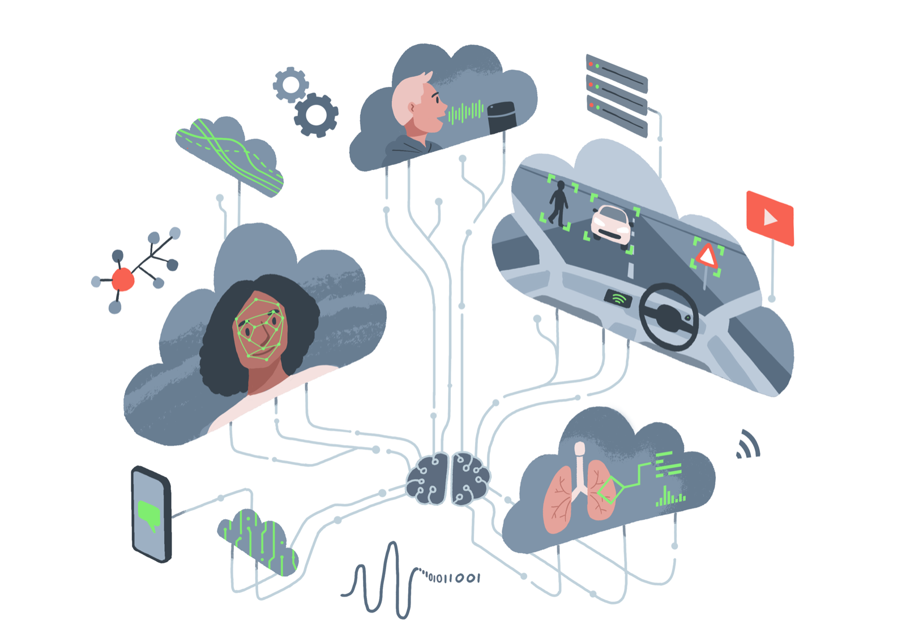

---
hide:
  - navigation
  - toc
---

{width="50%" align="right"}

# Welcome

Hello 👋
This is the Turing Commons—a home for resources and tools to help you reflect, discuss, and take responsibility for the design, development, and use of data-driven technologies.

Confused by that last sentence?
Don't worry you're still in the right place.
We have a range of resources for those curious about the ethical and responsible use of data, regardless of whether you're a curious citizen looking to have greater control over local matters, or a data scientist looking to take more responsibility over the consequences of your research.

This site is a living resource, however, which means the content is constantly being updated, revised, and refined. At present, the site is a home for several skills tracks and guidebooks, which have been designed for specific training courses we are in the process of delivering.

You can acess them [here](skills-tracks/index.md)

## Contributing

If you'd like to get involved and help contribute to these resources, you can either:

- Contribute on GitHub:
  - Comment on [issues](https://github.com/alan-turing-institute/turing-commons/issues), join a discussion, collaborate on an ongoing task and exchange your thoughts with others.
  - Can't find your idea being discussed anywhere? [Open a new issue](https://github.com/alan-turing-institute/turing-commons/issues/new)!
- Just want to get in touch? Feel free to send us an email: [cburr@turing.ac.uk](mailto:cburr@turing.ac.uk).
