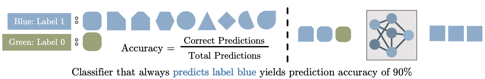

---
slideOptions:
  transition: slide
  spotlight:
    enabled: true
---

# Explainability (Section 4): Situating Explanations

> **Note**
> The following sections are part of this module:
>
> - Section 1: [What is Explainability?](rri-203-1.md)
> - Section 2: [Project Transparency](rri-203-2.md)
> - Section 3: [Model Interpretability](rri-203-3.md)
> - Section 4: [Situating Explanations](rri-203-4.md)

---

## The Importance of Trust

- Are Black-Box Algorithms Even Necessary? https://hdsr.mitpress.mit.edu/pub/f9kuryi8/release/8 
  - Consider the example of the surgeon and robot presented in the above article? Should we trust the 2% inaccuracy rate?
  - What subpopulation do we come from?
    - Here's a toy example:
    - 
    - If you are a member of the majority class, you might be happy with a 2% error rate.
    - But if you belonged to the minority class, you would care a lot more about the clearly awful coarse-grained model.

<!-- On trust and transparency 
Detecting the socio-economic drivers of confidence in government with eXplainable Artificial Intelligence: https://www.nature.com/articles/s41598-023-28020-5
-->

<!-- begin admonition -->
**Relationship between explainability and impact**

Improving the explainability of a system is not a trivial task. It will require, among other things, access to technical and domain-specific expertise, resources for clear and accessible documentation, opportunities for meaningful engagement with stakeholders.

Therefore, most organisations will need to adopt a proportional approach to explainabilty (as is also the case with the remaining SAFE-D principles).

A general rule for helping assess what a proportional investment in explainability should be is the following maxim:

> The greater the impact and scope of a system, the greater the need for explainability.

Where there may be concerns about malicious attacks on the system, such as people "gaming the system", it is important to differentiate 'intepretability' of the model from related properties such as 'project transparency' or 'system accesibility'. 

For example, a model be highly intepretable but inaccessible to anyone who is not authorised to access a secure research environment. Alternatively, a model can be highly interpretable and only used internally by a team who publish limited information about their project.
<!-- end admonition -->
